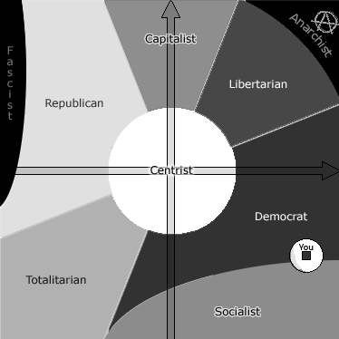
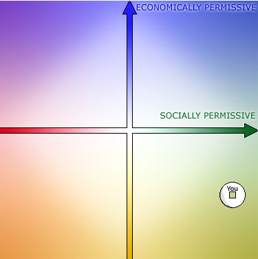

É assim que me descreve o [teste político do OkCupid](http://www.okcupid.com/politics). O resultado mais detalhado segue no resto do artigo.

Acho piada estar entre o Bono e o Gandhi, acho estranho ser tão pouco permissivo economicamente pois apenas respondi mais penosamente a coisas que me pareceram bem extremas. Curioso é considerar-me praticamente no limite entre o socialismo e o democrata norte-amerciano, mais próximo deste que do outro, pensava-me mais "centrista".

Enfim, pelo menos sei como seria considerado nos EUA, onde no geral estão um pouco mais "à direita" que a Europa.

<table style="border: 1px solid black" border="0"><tbody><tr><td align="center">You are a <strong>Social Liberal</strong> (90% permissive) and an... <strong>Economic Liberal</strong> (25% permissive) You are best described as a: <strong>Strong Democrat</strong></td></tr><tr><td align="center"></td></tr><tr><td align="center"></td></tr><tr><td align="center"></td></tr></tbody></table>

Link: [**The Politics Test**](http://www.okcupid.com/politics) on [**Ok Cupid**](http://www.okcupid.com/) Also: [The OkCupid Dating Persona Test](http://www.okcupid.com/online.dating.persona.test)
