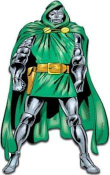

Your results: **You are Dr. Doom**

<table><tbody><tr><td><table><tbody><tr><td>Dr. Doom</td><td>
</td><td>68%</td></tr><tr><td>Apocalypse</td><td>
</td><td>60%</td></tr><tr><td>Green Goblin</td><td>
</td><td>60%</td></tr><tr><td>The Joker</td><td>
</td><td>59%</td></tr><tr><td>Lex Luthor</td><td>
</td><td>52%</td></tr><tr><td>Magneto</td><td>
</td><td>50%</td></tr><tr><td>Mr. Freeze</td><td>
</td><td>47%</td></tr><tr><td>Riddler</td><td>
</td><td>46%</td></tr><tr><td>Mystique</td><td>
</td><td>44%</td></tr><tr><td>Dark Phoenix</td><td>
</td><td>37%</td></tr><tr><td>Kingpin</td><td>
</td><td>37%</td></tr><tr><td>Juggernaut</td><td>
</td><td>36%</td></tr><tr><td>Two-Face</td><td>
</td><td>36%</td></tr><tr><td>Poison Ivy</td><td>
</td><td>34%</td></tr><tr><td>Catwoman</td><td>
</td><td>34%</td></tr><tr><td>Venom</td><td>
</td><td>30%</td></tr></tbody></table></td><td style="width: 250px">Blessed with smarts and power but burdened by vanity. </td></tr></tbody></table>

[Click here to take the Super Villain Personality Test](http://www.thesuperheroquiz.com/villain)

E não é de forma discreta, ora vejamos:

1. Dr. Viktor Von Doom é o arqui-enimigo dos Fantastic Four
2. Apocalypse é o arqui-enimigo dos X-Men
3. Green Goblin é o arqui-enimigo do Spider-man
4. The Joker é o arqui-enimigo do Batman
5. Lex Luthor é o arqui-enimigo do Superman
6. Mr. Freeze e Riddler são enimigos (menores) do Batman
7. Mystique e Dark Phoenix são grandes enimigos dos X-Men (erms, num estilo _on-off-on again_)
8. Kingpin é o arqui-enimigo do Daredevil
9. Juggernaut anteriormente enimigo (menor) dos X-Men, já não é vilão. Reformou-se.
10. Two-face, inicialmente amigo de Batman e Procurador Geral, Harvey Dent caiu em desgraça e tornou-se um seu mortífero enimigo
11. Poison Ivy é uma perigosa (mas menor) enimiga de Batman
12. Catwoman nunca foi exactamente uma vilã excepto em certos desenhos animados/séries de fraca qualidade
13. Venom é um arqui-enimigo do Spider-man, mas nem sempre.

O engraçado é que, com efeito, Doom é um dos meus vilões favoritos.
