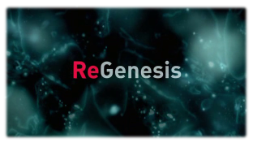

 Em mais um monumental erro de programação a SIC Radical deixou já há algum tempo de emitir esta **fenomenal** série canadiana, mas graças aos factos da vida, não deixei de continuar a acompanhá-la.

Acabei de devorar ver a 4ª temporada a um ritmo de 2/3 episódios por dia que, segundo consta, é o fim.

### Será mesmo o fim?

Ou será que não? Os rumores (nenhuma referência de jeito excepto [comentários no IMDB](http://www.imdb.com/title/tt0429422/board/nest/90340529)) são de que a ABC (empresa do grupo Disney) comprou qualquer coisa relacionada com a série, e os receios vão desde uma forte suavização (especialmente na crítica ao regime americano e na defesa à investigação com células embrionárias) ao "deita fora e começa de novo" que já deu cabo de várias outras séries.

Eu diria que "ser da Disney" não quer dizer tudo. O Pulp Fiction também é oriundo do grupo Disney.

### Os actores

Sinceramente não fico nada descansado, até porque grande parte do valor da série são os excelentes actores que tem. Perdê-los será dramaticamente difícil de compensar:

- [Peter Outerbridge](http://www.imdb.com/name/nm0653660/), como o genial, indomável, linfomaníaco, drogado, alcoólico e com traços de leve esquizofrenia, micro-biólogo e director científico do NORBAC [David Sandstrom](http://www.imdb.com/character/ch0069175/)
- [Mayko Nguyen](http://www.imdb.com/name/nm1534287/), como a bio-informática Mayko Tran
- [Conrad Pla](http://www.imdb.com/name/nm1074355/), como o geneticista homosexual [Carlos Serrano](http://www.imdb.com/character/ch0069176/)
- [Dmitry Chepovetsky](http://www.imdb.com/name/nm0155726/), como o _especial_ e génio bioquímico Bob Melnikov
- [Maxim Roy](http://www.imdb.com/name/nm0747114/), como a firme directora poliglota do NORBAC Caroline Morrison até morrer (a personagem) num atendado
- [Sarah Strange](http://www.imdb.com/name/nm0833385/), como a genial e frustrada virulogista Jill Langston
- [Ellen Page](http://www.imdb.com/name/nm0680983/), como a brilhantemente representada (infelizmente só na 1ª temporada) adolescente filha Lilith Sandstrom
- [Greg Bryk](http://www.imdb.com/name/nm0117374/), como o burocrata "_back stage dealer_" [Weston Field](http://www.imdb.com/character/ch0078998/)
- [Wendy Crewson](http://www.imdb.com/name/nm0187724/), como a misteriosa virulogista Rachel Woods, com um passado intrigante na classe política americana

E uma data de outras personagens recorrentes ou temporárias que alimentaram uma das melhores séries de sempre.

### Melhores (outras) características

- Uma profundamente deliciosa banda sonora de Tom Third, acompanha de selecções musicais de elevada qualidade
- Filmagem dinâmica com vários blocos acompanhando diferentes ângulos de forma simultânea ou levemente desfasada dando uma sensação de evolução da acção
- Novamente a filmagem dinâmica, mas fazendo _rewind_ até um ponto recente para nos mostrar o que aconteceu em "paralelo"
- Retoques de especial realismo tais como:
    - pesquisas no Google, sites de papers, nada de uma Internet maravilhosa que nunca ninguém viu antes como em quase todos os filmes que envolvem personagens informáticas
    - écrãs de computadores que realmente parecem (embora não saiba o suficiente para o atestar não parecem fantasias na sua generalidade) realmente estar a mostrar dados que poderiam ser úteis a tal equipa
    - cenários realistas de vida das pessoas (ir para o emprego de bicicleta, jantaradas de convívio em casa uns dos outros)
- e tantos outros pequenos pormenores que nos deliciaram

Uma coisa é certa: aconteça o que acontecer, para mim estas quatro temporadas ficaram-me para a memória. Mais surgissem :)
