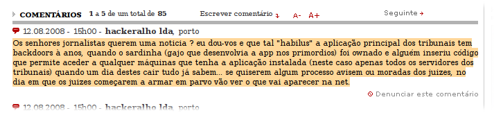

Saiu no [Público Última Hora uma notícia sobre os SMS](http://ultimahora.publico.clix.pt/noticia.aspx?id=1338652), uma vez armazenados na memória de um telemóvel, terem a mesma protecção jurídica que um documento que uma pessoa carregue consigo, ou seja, que pode ter de ser mostrado a um agente da autoridade que exija a sua apresentação, sem mandato.

Se o conteúdo da notícia é relativamente preocupante (não sabia sequer que um documento qualquer que venha comigo não tenha protecção nenhuma), assustou-me ainda mais o comentário de um anónimo:

\[caption id="attachment\_178" align="aligncenter" width="500" caption="Comentário do Hackeralho"\]\[/caption\]

Diz então o texto (caso não esteja legível no screenshot ligado pela imagem anterior):

> Os senhores jornalistas querem uma noticia ? eu dou-vos e que tal **"habilus" a aplicação principal dos tribunais tem backdoors à anos**, quando **o sardinha** (gajo que desenvolvia a app nos primordios) **foi ownado e alguém inseriu código que permite aceder a qualquer máquinas que tenha a aplicação instalada** (neste caso apenas todos os servidores dos tribunais) quando um dia destes cair tudo já sabem... se quiserem algum processo avisem ou moradas dos juizes, no dia em que os juizes começarem a armar em parvo vão ver o que vai aparecer na net.

Fogo (os negritos são meus)!
