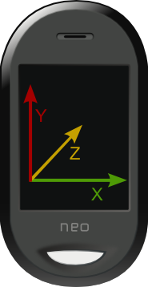

So... following up on my patch for a [better xrandr rotation](http://blog.1407.org/2008/09/20/openmoko-rotate-now-using-libxrandr/) on [Rotate](http://wiki.openmoko.org/wiki/Rotate), I've been learning [how to read the accelerometers](http://wiki.openmoko.org/wiki/Accelerometer_data_retrieval), and it's a lot of fun, actually. I'm so thrilled... I really missed programming :)

Now, the good news is that in a couple of days (hopefully) I'll be posting a completely new Rotate. I'm collecting some positioning data from the second accelerometer, and right now I already know a few positions, at least my little test program is guessing some positions quite right...

s/guess position/libxrandr rotate/ and you get the new Rotate :)

All this without running the risk of seeing this software banned (like the iDictatorPhone), where it seems some programmer got his [application banned on the iDictatorPhone because it competed with Mail.App](http://rss.slashdot.org/~r/Slashdot/slashdot/~3/mTMnEK87IqY/article.pl). Nice one, Apple, you're only proving us, Free Software activists, right. Again. :)

The following is the current output as I pick it up from the table and place it from turned up into turned down.

Postion (90,90,1026):  horizontal turnedUp
Postion (90,72,990):  horizontal turnedUp
Postion (36,54,990):  horizontal turnedUp
Postion (-36,36,990):  horizontal turnedUp
Postion (18,18,972):  horizontal turnedUp
Postion (18,936,0):  upsideDown
Postion (18,36,882):  horizontal turnedUp
Postion (36,36,900):  horizontal turnedUp
Postion (18,18,1008):  horizontal turnedUp
Postion (-36,1080,0):  upsideDown
Postion (-36,-36,1080):  horizontal turnedUp
Postion (72,1134,0):
Postion (54,18,1314):  horizontal
Postion (54,54,1386):  horizontal
Postion (18,144,1404):  horizontal
Postion (-36,198,1386):  horizontal
Postion (-72,234,1296):
Postion (-54,108,1152):  horizontal
Postion (-396,-72,936):  horizontal turnedUp
Postion (-864,-198,1080):  horizontal left turnedUp
Postion (-504,-36,918):  horizontal turnedUp
Postion (-504,54,1026):  horizontal turnedUp
Postion (-414,54,1098):  horizontal turnedUp
Postion (18,-54,774):  horizontal
Postion (234,-288,378):
Postion (180,-666,18):
Postion (414,-720,216):
Postion (-36,-1080,0):  vertical
Postion (90,-774,-72):
Postion (126,-270,-216):
Postion (234,702,360):
Postion (-360,378,-2304):
Postion (864,1170,-918):  right turnedDown
Postion (126,702,-1800):
Postion (288,558,-1494):
Postion (270,288,-1314):
Postion (54,108,-1206):  horizontal
Postion (108,162,-1098):  horizontal turnedDown
Postion (288,108,-882):  horizontal turnedDown
Postion (342,162,-792):  horizontal
Postion (270,72,-828):  horizontal turnedDown
Postion (306,36,-972):  horizontal turnedDown
Postion (306,90,-1188):  horizontal
Postion (270,324,-1332):
Postion (180,396,-1278):
Postion (126,450,-1386):
Postion (-36,522,-1674):
Postion (36,270,-1404):
Postion (180,90,-1080):  horizontal turnedDown
Postion (72,72,-1044):  horizontal turnedDown
Postion (54,90,-1044):  horizontal turnedDown
Postion (-18,72,-1080):  horizontal turnedDown
Postion (18,72,-1026):  horizontal turnedDown
Postion (18,36,-1080):  horizontal turnedDown
Postion (18,36,-1134):  horizontal
Postion (36,36,-1098):  horizontal turnedDown
Postion (54,36,-1098):  horizontal turnedDown
Postion (90,54,-1080):  horizontal turnedDown
