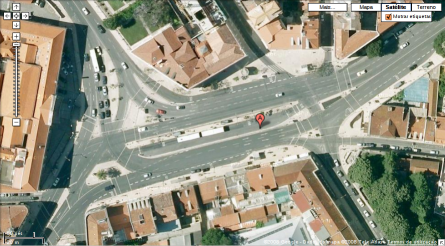
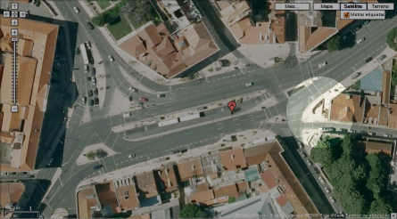

No Público Última Hora [li que há uma polémica no Largo Do Rato](http://ultimahora.publico.clix.pt/noticia.aspx?id=1345644), Lisboa, porque se pretende construir lá um prédio. Uma proposta alternativa diz que se deveria antes construir um jardim, uma vez que não há lá nenhuma árvore condigna.

Entre prédio ou jardim, por mim venha o jardim em qualquer momento que me perguntem, mas a minha dúvida é **onde, num largo tão cheio de trânsito e estrada, é que ficaria fosse o que fosse**?

\[caption id="attachment\_251" align="aligncenter" width="445" caption="Largo do Rato, Lisboa, Portugal"\]\[/caption\]

Um grande obrigado ao João Craveiro por me ter explicado onde é que estão a pensar fazer a asneirada e onde propõe fazer um jardim em vez da asneirada. Acho no entanto que a área em causa é tão pequena que nada de jeito ser faria lá...

