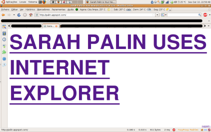

O site [http://palin.appspot.com/](http://palin.appspot.com/) está recheado de citações anti-Sarah Palin. Enquanto fazia reload apanhei esta:

\[caption id="attachment\_248" align="aligncenter" width="422" caption="Sarah Palin Uses Internet Explorer"\]\[/caption\]

Aproveitei para sugerir que _Sarah Palin also says «nucular» weapons_ (e é verdade, vi o debate Joe Biden vs Sarah Palin e fiquei estupefacto, será que existe mesmo um culto dos erros Bushianos?)
