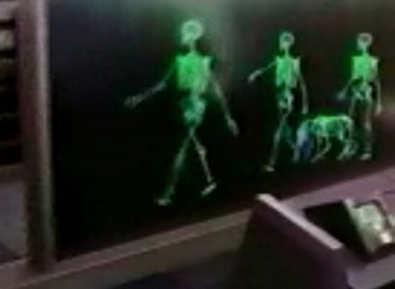
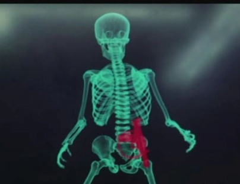
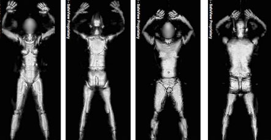

Lembra-se do Total Recall? Lembra-se dos _scanners_ de raios X em que se viam os ossos de quem passava, e que uma arma ficaria bem visível a vermelho?

<table border="0" align="center"><tbody><tr><td>

[caption id="attachment_284" align="alignnone" width="150" caption="Scanner do Total Recall vê somente ossos"][/caption]</td><td>

[caption id="attachment_283" align="alignnone" width="150" caption="Scanner do Total Recall descobre uma arma"][/caption]</td></tr></tbody></table>

Aqueles eram ficção, de cinema... Agora imagine como são os **reais**?

\[caption id="attachment\_285" align="aligncenter" width="330" caption="Scanners reais"\]\[/caption\]

Saliento a claramente excessiva visibilidade...

Ainda bem que os [alemães rejeitaram sumariamente a proposta da Comissão Europeia de obrigar a utilização desta tecnologia](http://www.thelocal.de/15107/20081024/)!
