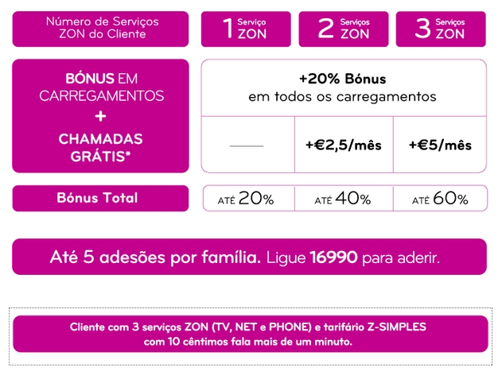

Na [campanha de adesão ao Zon Mobile](http://www.zon.pt/Mobile/OfertasPromocoes.aspx), está lá uma **mentira**: que o cliente com 3 serviços zon fala mais que um minuto com 10¢ (carregar na imagem para ampliar):

\[caption id="attachment\_312" align="aligncenter" width="330" caption="Mais de um minuto por 10¢? Mentira! São 15¢/minuto!"\]\[/caption\]

E **eu afirmo que é mentira** porque **o serviço de apoio à adesão confirmou que não há qualquer desconto**.

Ora se o preço da chamada são 0.0025€/segundo, isso faz 15¢/minuto em vez de "mais de 1 minuto por 10¢".

Estes senhores estão a merecer que clientes que adiram ao serviço exijam o cumprimento do preço anunciado.
