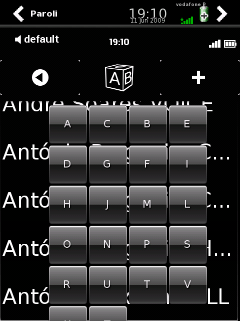

Om2009's telephony application is Paroli, and it uses it's own contacts database. [Ingvaldur Sigurjonsson made a script to import VCF contacts](http://www.mail-archive.com/support@lists.openmoko.org/msg04770.html) but it wouldn't work on most of my contacts, which were imported via Bluetooth about two years ago.

Since some had CRLF and others had LF as line terminators (ok, some VCF contacts were hand-made, as it's a very nice contacts backup format which you can grep, etc...), I hacked the script to handle both cases, but mostly, to handle the case when the phone\_info list had only one element, which the script wouldn't take in account resuling in about 150 contacts lost from 270.

It also doesn't take in account **PREF**erred phone numbers, so I removed then with the following command:

sed -i -e 's,;PREF,,' \*.vcf

As it is likely helpful to others, here it is under a title which will surely be picked up by search engines for this issue: [vcf2paroli](http://files.1407.org/openmoko/contacts/vcf2paroli)

Do you enjoy the results?

\[caption id="attachment\_512" align="aligncenter" width="274" caption="Successfully imported 270 contacts!"\]\[/caption\]

There two things I didn't like:

1. it imported multiple times the same contact if it has more than one phone number
2. clicking on the die produced the expected result but with a bug: some buttons are hidden (so I registered [bug #180](http://www.paroli-project.org/trac/ticket/180))

\[caption id="attachment\_513" align="aligncenter" width="274" caption="Oops! They don't fit at all! #180"\]\[/caption\]
