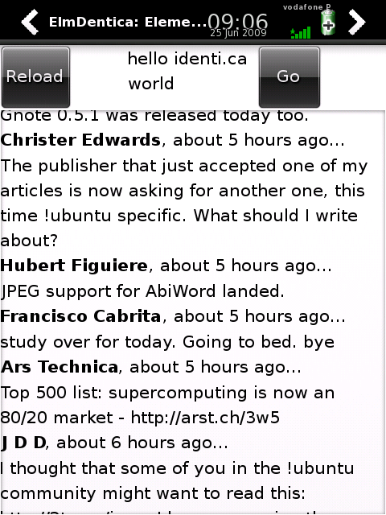

Hi, this new version is a bit more usable (although it clearly lacks features and has bugs-a-plenty), enjoy!

- [elmdentica-0.1.0.tar.gz](http://elmdentica.googlecode.com/files/elmdentica-0.1.0.tar.gz.asc) ([elmdentica-0.1.0.tar.gz.asc](http://elmdentica.googlecode.com/files/elmdentica-0.1.0.tar.gz.asc))
- [elmdentica\_0.1.0-r0\_armv4t.ipk](http://elmdentica.googlecode.com/files/elmdentica_0.1.0-r0_armv4t.ipk) ([elmdentica\_0.1.0-r0\_armv4t.ipk.asc](http://elmdentica.googlecode.com/files/elmdentica_0.1.0-r0_armv4t.ipk.asc))
- [elmdentica at Google Code](http://code.google.com/p/elmdentica/)

\[caption id="" align="aligncenter" width="320" caption="Release 0.1.0 in action"\]\[/caption\]
