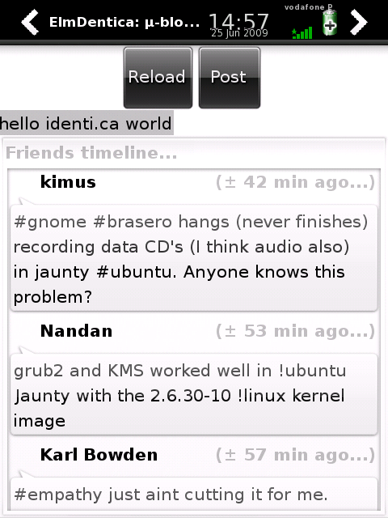

Wow, again you say? Well, early stages of development are like that :) Its starting to shape up a little better (even if still a bit too memory hungry - 15% WTF). As usual, available at [Elmdentica's google code page](http://code.google.com/p/elmdentica/), or the links below:

- [elmdentica-0.2.0.tar.gz](http://elmdentica.googlecode.com/files/elmdentica-0.2.0.tar.gz) ([elmdentica-0.2.0.tar.gz.asc](http://elmdentica.googlecode.com/files/elmdentica-0.2.0.tar.gz.asc))
- [elmdentica\_0.2.0-r1\_armv4t.ipk](http://elmdentica.googlecode.com/files/elmdentica_0.2.0-r1_armv4t.ipk) ([elmdentica\_0.2.0-r1\_armv4t.ipk.asc](http://elmdentica.googlecode.com/files/elmdentica_0.2.0-r1_armv4t.ipk.asc))

\[caption id="" align="aligncenter" width="320" caption="Release 0.2.0 in action..."\]\[/caption\]
