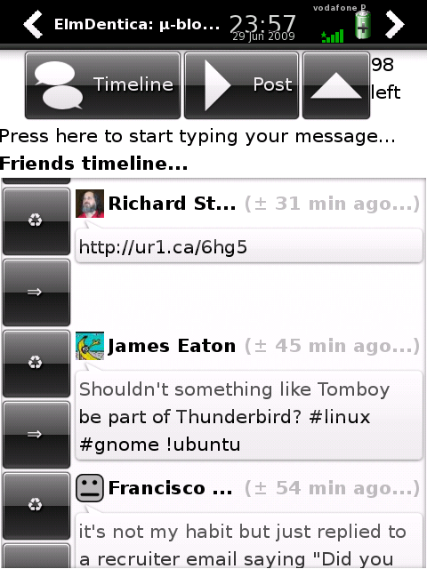

Hi! A release a day! 0.4.0 doesn't add THAT much, unless you like to, you know... repeat (or _retweet_) what other say and reply to others, or maybe proudly show you're using Elmdentica! :) Oh... and a counter (but it lets you type more than 140... just warns...)

\[caption id="" align="aligncenter" width="320" caption="0.4.0 in action..."\]\[/caption\]

- [elmdentica-0.4.0.tar.gz](http://elmdentica.googlecode.com/files/elmdentica-0.4.0.tar.gz) ([elmdentica-0.4.0.tar.gz.asc](http://elmdentica.googlecode.com/files/elmdentica-0.4.0.tar.gz.asc))
- [elmdentica\_0.4.0-r2\_armv4t.ipk](http://elmdentica.googlecode.com/files/elmdentica_0.4.0-r2_armv4t.ipk) ([elmdentica\_0.4.0-r2\_armv4t.ipk.asc](http://elmdentica.googlecode.com/files/elmdentica_0.4.0-r2_armv4t.ipk.asc))
