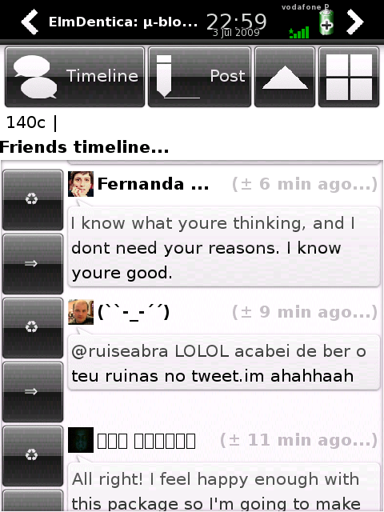

New release of [elmdentica](http://code.google.com/p/elmdentica/), major advance! 0.5.0 adds [multiple account support](http://code.google.com/p/elmdentica/wiki/GConf), even though only one active at each moment.

0.5.0 in action...

- [elmdentica-0.5.0.tar.gz](http://elmdentica.googlecode.com/files/elmdentica-0.5.0.tar.gz) ([elmdentica-0.5.0.tar.gz.asc](http://elmdentica.googlecode.com/files/elmdentica-0.5.0.tar.gz.asc))
- [elmdentica\_0.5.0-r6\_armv4t.ipk](http://elmdentica.googlecode.com/files/elmdentica_0.5.0-r6_armv4t.ipk) ([elmdentica\_0.5.0-r6\_armv4t.ipk.asc](http://elmdentica.googlecode.com/files/elmdentica_0.5.0-r6_armv4t.ipk.asc))
