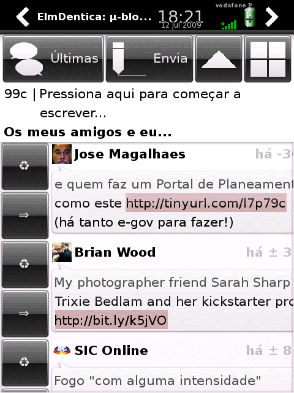

ElmDentica (the Tuga release), is now translatable and the first included localization is Portuguese (hence Tuga) :)

\[caption id="attachment\_551" align="aligncenter" width="320" caption="Elmdentica 0.6.0 in action (in portuguese)"\]\[/caption\]

It will also now launch a browser if you confirm after pressing on a link. Right now, the following browser choice is made:

1. [this version of woosh](http://elmdentica.googlecode.com/files/woosh_0.1.1-r0_armv4t.ipk) ([sig](http://elmdentica.googlecode.com/files/woosh_0.1.1-r0_armv4t.ipk.asc)), which I hacked to load urls passed with the -u flag
2. or midori
3. or dillo
4. or xdg-open

Download and enjoy:

- [elmdentica-0.6.0.tar.gz](http://elmdentica.googlecode.com/files/elmdentica-0.6.0.tar.gz) - [elmdentica-0.6.0.tar.gz.asc](http://elmdentica.googlecode.com/files/elmdentica-0.6.0.tar.gz.asc)
- [elmdentica\_0.6.0-r8\_armv4t.ipk](http://elmdentica.googlecode.com/files/elmdentica_0.6.0-r8_armv4t.ipk) - [elmdentica\_0.6.0-r8\_armv4t.ipk.asc](http://elmdentica.googlecode.com/files/elmdentica_0.6.0-r8_armv4t.ipk.asc)
- [woosh\_0.1.1-r0\_armv4t.ipk](http://elmdentica.googlecode.com/files/woosh_0.1.1-r0_armv4t.ipk) -  [woosh\_0.1.1-r0\_armv4t.ipk.asc](http://elmdentica.googlecode.com/files/woosh_0.1.1-r0_armv4t.ipk.asc)
