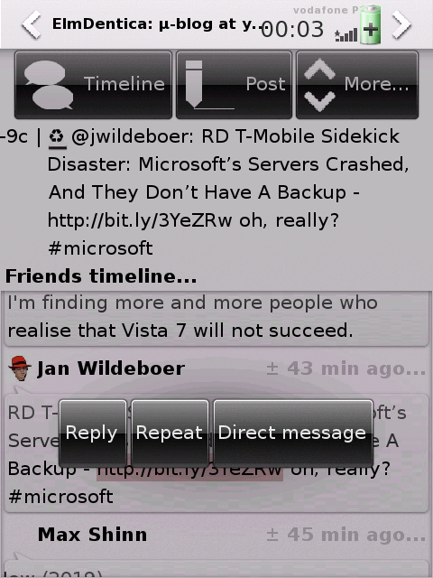

\[caption id="" align="alignleft" width="160" caption="Screenshot of release 0.7.0"\]\[/caption\]

\[caption id="" align="alignright" width="160" caption="Press a bubble for about 1s and magic action possibilities will show up."\]\[/caption\]

Hi everyone! ElmDentica hasn't had a new release for a while (_\*cough\*cough\* proving it works so well \*cough\*cough\*_), so I though I should share with you the new stuff in the development of this release.

The news are:

- Replacement of the side buttons by hover's fired up **by pressing for about 1s over the bubble**
- Usage of inwins for entering user and domain data in the settings window
- Usage of hoversel to gain a few more space on the toolbar, specially for future features

So that's about it... you can get the package from the usual places, the [project's web-site](http://code.google.com/p/elmdentica/), by upgrading shr-unstable as it upgrades elmdentica on next autobuild, building it yourself, etc...

- [elmdentica-0.7.0.tar.gz](http://elmdentica.googlecode.com/files/elmdentica-0.7.0.tar.gz) ([elmdentica-0.7.0.tar.gz.asc](http://elmdentica.googlecode.com/files/elmdentica-0.7.0.tar.gz.asc))
- [elmdentica\_0.7.0-r4\_armv4t.ipk](http://elmdentica.googlecode.com/files/elmdentica_0.7.0-r4_armv4t.ipk) ([elmdentica\_0.7.0-r4\_armv4t.ipk.asc)](http://elmdentica.googlecode.com/files/elmdentica_0.7.0-r4_armv4t.ipk.asc)
