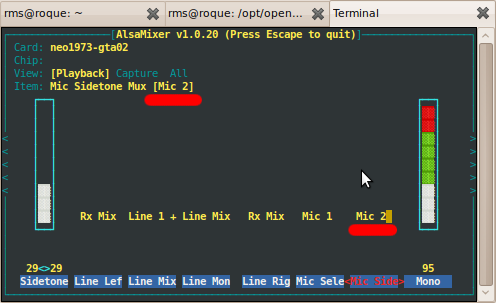
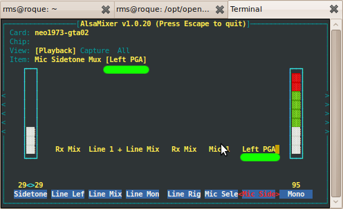

One of the problems people complain about my calls from the Freerunner is \*bad\*sound\*. Lot's of background noise, static, etc. I'm not talking about the familiar buzz problem, as [I've had the buzz fix applied to my phone](http://picasaweb.google.com/RuiMSeabra/DebConf9OpenMokoBuzzFixParty#). However what I found to fix this problem on my phone model (GTA02v5 + buzz fix) goes totally against the [official information](http://wiki.openmoko.org/wiki/Neo_Freerunner_audio_subsystem#Alsamixer_channel_controls). So much so that there's at least one person who, from his very good knowledge about this subject (Really! This is **\*not\*** sarcasm!), thinks this fix is as good as putting some peanut butter over the microphone :)\[[1](http://wiki.openmoko.org/index.php?title=Talk:Neo_Freerunner_audio_subsystem&oldid=77886)\]

I know of at least one other person who claims to have better sound on remote end from this fix, but I think I need to drop the challenge. Can you try the current SHR Unstable, apply this fix and then report on the mailing lists your results?

You can? Good! So here's the fix:

1. call someone who noticed your bad sound and check whether the sound is still bad, then finish the call
2. edit /etc/freesmartphone/alsa/default/gsmhandset
3. change control 63 (it's also on line 63), so that it ends in 3 rather than in 2:
    1. **Old** value: 63:'Mic Sidetone Mux':1:2
    2. **New** value: 63:'Mic Sidetone Mux':1:3
4. call that person again and check the result

Alternatively, in one call, you can ssh into your phone and use alsamixer to change the same control, but this change will not be persistent until you do the steps above.

\[caption id="attachment\_674" align="aligncenter" width="496" caption="Old Value"\]\[/caption\]

\[caption id="attachment\_675" align="aligncenter" width="496" caption="New Value"\]\[/caption\]

So let's hear your results, nothing like a good empirical experiment.

**\[UPDATE: Added sound recordings\]**

In the following recordings ([complete set here](http://files.1407.org/openmoko/mic_sidemux_test/)), I said «The quick brown fox jumps over the lazy dog» starting with Mic2, then Right PGA, then Left PGA.

1. [in perfect conditions](http://files.1407.org/openmoko/mic_sidemux_test/test1-perfect-conditions.wav);
2. [with tv making background noise](http://files.1407.org/openmoko/mic_sidemux_test/test2-with-tv.wav) (news);
3. [2\. + computer playing loud music](http://files.1407.org/openmoko/mic_sidemux_test/test3-with-tv-and-music.wav) («Te Quiero Puta» from Rammstein) at the same time.

http://wiki.openmoko.org/wiki/Neo\_Freerunner\_audio\_subsystem#Alsamixer\_channel\_controls
