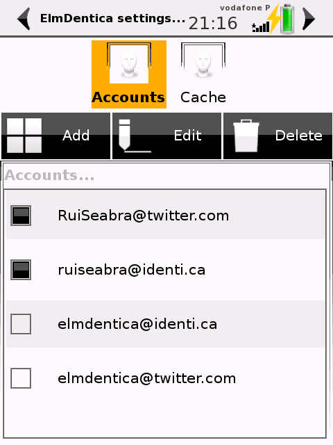

\[caption id="" align="alignleft" width="209" caption="Screenshot of account editor at the settings window."\]\[/caption\]

Hi,

I've just release [ElmDentica 0.8.0](http://code.google.com/p/elmdentica/downloads/list) with a bit more polished screens and exciting new features:

- you can have more than one account, and if you have many accounts, only a few of them enabled or disabled quickly.
- you have a messages and posts cache (albeit the last one is still incomplete)

So there you go, download if you're too impatient to wait for SHR-unstable to update :)

- [elmdentica-0.8.0.tar.gz](http://elmdentica.googlecode.com/files/elmdentica-0.8.0.tar.gz) ([elmdentica-0.8.0.tar.gz.asc](http://elmdentica.googlecode.com/files/elmdentica-0.8.0.tar.gz.asc))
- [elmdentica\_0.8.0-r1.4\_armv4t.ipk](http://elmdentica.googlecode.com/files/elmdentica_0.8.0-r1.4_armv4t.ipk) ( [elmdentica\_0.8.0-r1.4\_armv4t.ipk.asc](http://elmdentica.googlecode.com/files/elmdentica_0.8.0-r1.4_armv4t.ipk.asc))
