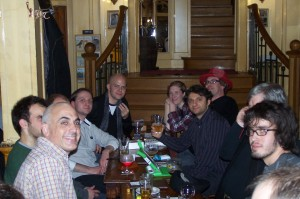
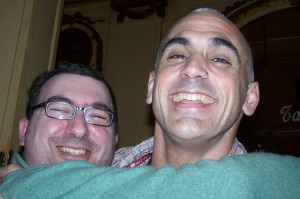

As usual, the weekend at FOSDEM is awesome. It all started on the previous Wednesday as I flew from the day job towards Brussels. Still nobody I knew there, so I basically went straight to bed.

The adventure started at the capacity event conference organized by EDRi at the European Parliament. I enjoyed very much to finally meet some people I only knew online, some of them for quite a few years.

The theme was, of course, digital rights in Europe. ACTA is some scary shit, not so much about the undemocratic secrecy, but because of the few contents that have spilled out, like three strikes to take you off the Internet, criminal offences for copyright, trademark and patent infringement, etc. No wonder the European Comission representatives claim ACTA will not change european law, I mean... just add up the EUCD, IPRED1, Data Retention Directive, eventually IPRED2 and other Trade Agreements that are happening, by the time ACTA comes up all the scary military-state-like laws will already be in place.

So it's true, it won't change, because change is happening **before** ACTA comes to be. _Fait accomplit_!

More about this theme at a later posting, reflecting my summary of the event. Get ready for the real life pirates who are threatening our digital rights.

It was almost midnight when I learned that a good friend I was expecting to meet again was getting married the following morning, so I had to join [@jwildeboer](http://identi.ca/jwildeboer) (who had just flown in) for one celebratory drink, which ended up with a few hours of a very interesting talk with [@kanarip](http://identi.ca/kanarip). He's an amazingly interesting no-bull-shit guy, if you ever meet one. Respect!

Unfortunately I had to cut the event short and missed the last quarter, Friday afternoon, to join an OpenForum Europe meeting. At some point the warm fuzzy feeling of a family getting together was felt in the room :)

After that, dinner with more interesting people. Some came from the EDRi event, some from the OFE meeting, and one ([@webmink](http://identi.ca/webmink), whom I felt very honoured to have personally met) was already waiting for us at Le Roi  before dinning, and let me tell you that before eating at the place Simon took us, the [Roue D'Or](http://www2.resto.be/rouedor/) at Rue des Chapeliers, I though there was no decent food in Brussels (even if you have to be a bit of a masochist with the service).

After that, realizing that the FOSDEM #googlebeer event at the Delirium was so packed it was impossible to stay there, Mark Taylor joined us as we moved to A La Morte Subite for a drink with some Java developers.

Next morning, FOSDEM. Met [@stephwer](http://identi.ca/stephwer) and Jan for breakfast then came back for a couple of talks before meeting up with more people I haven't seen for a while, like [@zoobab](http://identi.ca/zoobab) who was kind enough to host me last year, and some of the great guys from Tux Brain, who buzz fixed my OpenMoko (and David Samblas [posted a lot of pictures](http://www.tuxbrain.com/en/content/fosdem2010-desde-dentro-en-un-rinc%C3%B3n)).

Then we left early, for #statuscheck, the Identi.ca meetup at A La Morte Subite. Finally meeting [@evan](http://identi.ca/evan), the founder of [Status.Net](http://status.net/) (formerly Laconi.ca), the Free Software behind [Identi.ca](http://identi.ca) (it's like Twitter but with the cool people), fellow OpenMoko user [@pieterc](http://identi.ca/pieterc), and some awesome guys like [@rejon](http://identi.ca/rejon), [@gbraad](http://identi.ca/gbraad), [@blizzard](http://identi.ca/blizzard) (whose beard is not at all nearly as black as his avatar's) and all the others in the table:

\[caption id="attachment\_737" align="aligncenter" width="300" caption="#statuscheck meet up"\]\[/caption\]

[@bugabundo](http://identi.ca/bugabundo) (who could not go), asked me to send @evan a hug, here's the evidence (thanks to @pieterc):

\[caption id="attachment\_738" align="aligncenter" width="300" caption="Hugging @evan"\]\[/caption\]

After #statuscheck, joined @webmink and some friend of his for dinner at Roue D'Or again (yum, yum), and then we joined a couple of Mozilla People, namely Patrick Flich, who together with @webmink and I stayed up until expelled from a bar which wanted to close down. Good excuse for going to bed :)

The day after I had to do some chocolate shopping before FOSDEM, so I missed half the OpenMoko talks at the devroom. Still... I arrived in time to meet heinervdm, mickeyl and GNUtoo.

Then I me [@alxc](http://identi.ca/alxc) from April, [@floschi](http://identi.ca/floschi) from LiMuX and attended @rejon's and [@vegyraupe](http://identi.ca/vegyraupe)'s [Ben Nanonote](http://www.qi-hardware.com/products/ben-nanonote/) talk. A very interesting and promising device, I hope it's successful enough to launch [Qi Hardware](http://www.qi-hardware.com/) into a bright future. Check it out! Now!

Then I had to get back straight to the hotel, as I was going to wake up at 4am in order to get back to Portugal, straight to my day job. It was like waking up from a dream.

I wish it was FOSDEM for all year long :)
