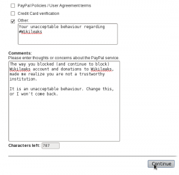
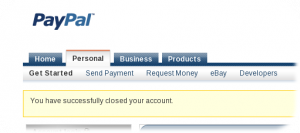

I've just cancelled my Paypal account because I can't agree with their actions regarding #Wikileaks. They should  not have prevented them from getting donations, either [by harassing them](https://www.thepaypalblog.com/2010/12/updated-statement-about-wikileaks-from-paypal-general-counsel-john-muller/) or [harassing other customers who donated](http://www.reddit.com/r/WTF/comments/ejzfp/paypal_shut_my_account_today_because_my_business/) (if true).

I don't support #DDOS attacks, they've made my attempts to cancel the account much harder, and my cancelling of the account shows a better protest than making it harder for innocent people to do their business.

**Update:** it was a bit hard to do because of the #DDOS, but eventually I did it.

\[caption id="attachment\_1048" align="aligncenter" width="300" caption="#PayPal. No longer «the world's most-loved way to pay and be paid.» #wikileaks"\]\[/caption\]
