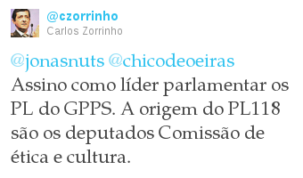
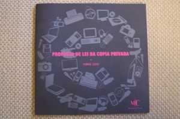
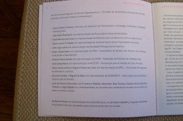

Ficção:

> "_A origem do PL118 são os deputados Comissão de ética e cultura._" -- Carlos Zorrinho, PS

[Realidade](http://blog.1407.org/2011/05/03/proposta-do-ps-de-lei-da-copia-privada/):

O documento apresentado no passado Maio de 2011 pela então Ministra Gabriela Canavilhas identificavao grupo responsável pela elaboração do #PL118.

A saber:

> Nos termos do Artigo 24° do Decreto Regulamentar n.° 35/2007, de 29 de Março, a Secção dos Direitos de Autor e Directos Conexos é composta por:
> 
> \* GPEARI \* PGR \* GMCS \* INPI \* SPA \* AGECOP \* APEL \* AUDJOGEST \* Radiodifusoras \* IGAC \* José de Oliveira Ascensão \* Luiz Francisco Rebello \* Alexandre Dias Pereira \* Cláudia Maria Salsinha Trabuco \* Jorge Pegado Liz

A dúvida aqui é mais sobre se o Carlos Zorrinho sabia disto ou não.

Não é teoria, o documento apresentado no passado Maio de 2011 pela então Ministra Gabriela Canavilhas identificavao grupo responsável pela elaboração do #PL118. A saber: 

Nos termos do Artigo 24° do Decreto Regulamentar n.° 35/2007, de 29 de Março, a Secção dos Direitos de Autor e Directos Conexos é composta por:

\* GPEARI \* PGR \* GMCS \* INPI \* SPA \* AGECOP \* APEL \* AUDJOGEST \* Radiodifusoras \* IGAC \* José de Oliveira Ascensão \* Luiz Francisco Rebello \* Alexandre Dias Pereira \* Cláudia Maria Salsinha Trabuco \* Jorge Pegado Liz
