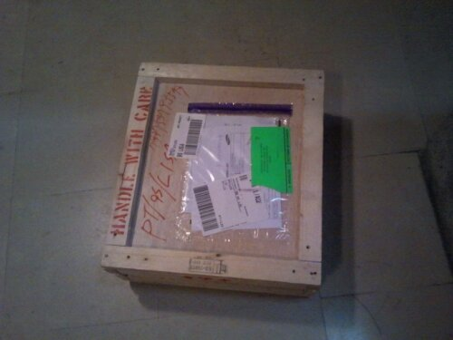
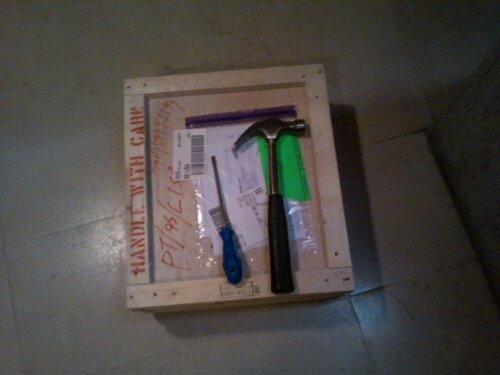
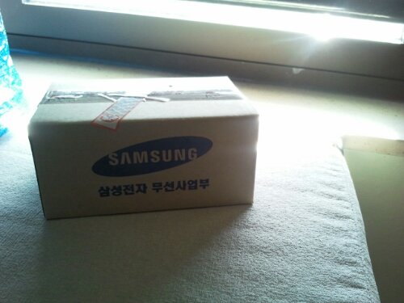
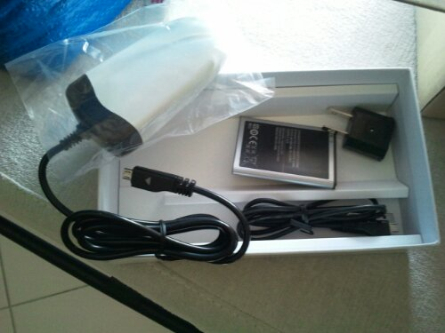
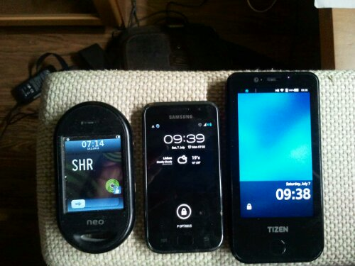

By parts... This first one will just reflect up until the unpacking.

So I got lucky to be offered the possibility of having a Tizen development phone.

I was quite excited as it will also be using [Enlightenment](http://enlightenment.org/) as window manager, a project where I have done some modest collaboration, mostly because meanwhile my kid was born and what little free time I had got a lot more constrained.

Anyways, the excitement got only bigger as I get a call from FedEx to help them free a package from Customs by explaining what relation I had with Samsung.

After they cleared it, I went to their station to get the box...

Yes, it was packed in a wooden box, all hammered in.

I thought it was a puzzle for opening, but I just decided to get the best puzzle tools ever for this kind of puzzle...

So here it finally was... A small phone sized box inside a huge 6 kg wooden box.

As I opened it, the contents where a phone... An immensely ugly phone (to be fair, it's a generic development case and not a finished product which may even not have the same SoC), an USB/micro-USB cable, a battery, a US plug adapter and a very well hidden wall charger, and a nice business card from another developer with "Enjoy" written on it.

So yeah, I got mocked about the wall charger  :-)

Before knowing what it was, it gave zero clues of what it was, external GPS perhaps? I tried to pull the white part but it seemed stuck so I didn't force it. It's not like I have any kind of warranty, right? So be careful...

When  I asked around, light mocking came up but also an admission that I wasn't the first one wondering what it was.  :-) After forcing it for the first time, the next attempts came out with ease.

So, to finish, a little visual comparison of my phones...

NOTE: from left to right, my personal phone is the [OpenMoko Neo Freerunner](http://wiki.openmoko.org/wiki/Neo_FreeRunner), my job's phone is a Samsung Galaxy S (depicted in picture was my wife's one as mine was taking the picture, both with Android ICS from Cyanogenmod 9) and at the right is the Tizen 1 dev phone. My SIM card was unloaded from Neo into the Tizen phone at the time of this picture, but after 4 years, Neo still makes and receives calls while Tizen 1 dev phone... doesn't... support... calls... WTF? A story for another article...
