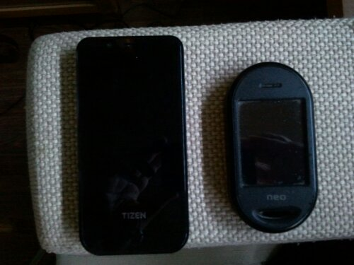

So, can you guess which of the following two phones, a [Tizen dev phone](http://lwn.net/Articles/498307/) and an [Openmoko Neo Freerunner](http://wiki.openmoko.org/wiki/Neo_FreeRunner) (in practice a dev phone too) can make and receive calls?

The one on the right has been able to make calls since I received it in 2008 (albeit without buzz only after one year after a hardware patch performed by my heroes at [TuxBrain](http://www.tuxbrain.com/) at DebConf 9), while the one on the left, doesn't even detect the SIM card.

The one on the left is made by a very successful phone maker with deep pockets, Samsung, while the one on the right was made in 2008 by a small company that had more will than capacity to do a great phone, OpenMoko, and still today carries my personal SIM with which I call and get calls from people, using a truly community built distribution based on OpenEmbedded called [SHR](http://shr-project.org/).

This was my first #facepalm moment with this device with which I was very excited and had lots of expectations.

