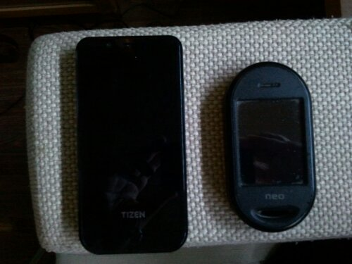

So, can you guess which of the following two phones, a [Tizen dev phone](http://lwn.net/Articles/498307/) and an [Openmoko Neo Freerunner](http://wiki.openmoko.org/wiki/Neo_FreeRunner) (in practice a dev phone too) has or ever had 3D acceleration?

The one on the right never had 3D acceleration since it was made in 2008 (would require an unavailable blob, but it neither had the bandwidth for that), while the one on the left actually cam with 3D acceleration but **lost it after flashing an upgrade image and there's no legal way to get it back**.

So... what happened? I found out that on June 13th a Tizen update was published. I hoped it would fix the phoning issue, making it finally possible to make calls (hint, it doesn't solve [that issue](http://blog.1407.org/2012/07/15/which-of-these-two-can-make-calls/) either), so I flashed it (it was a pretty easy and painless flash).

Reboot and... What.The.Hell? It was now very slow, almost as slow as the OpenMoko's interface. There's is no warning anywhere near that image, and being development snapshots I would expect a problem or two, a fix or two, etc... but not this... oh no... not this...

Apparently, the ARM Mali graphics chip that is inside **requires distribution only with the hardware, no software distribution**.

As such, **no Tizen update can be installed without actually crippling the phone's performance**, and now I have no legal manner to get the driver back into the phone.

Knowing this, like Samsung **must have known**, the least Samsung should have done is keep a separate partition with the driver which would be mounted on system startup, thus providing the driver to any software update that they publish.

But oh no... that would be, what... too much trouble? Nobody would notice the performance loss?

Here goes another #facepalm moment!

I guess all that remains is try to boot from SD, if that is possible, then maybe one can setup an OpenEmbedded profile and perhaps get a **real** development platform for the phone.

One can only dream... but... this Tizen 1 dev phone looks more and more like a brick. Maybe it'll be a shiny paperweight soon.
