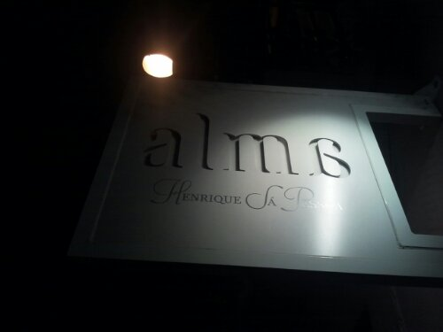
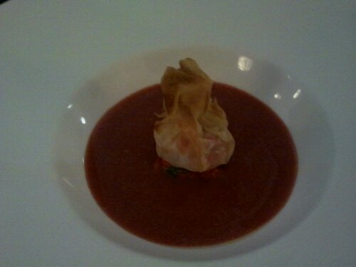
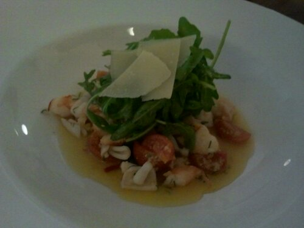
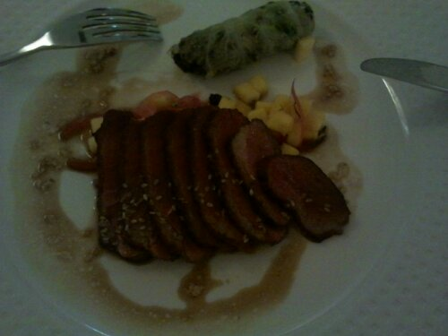
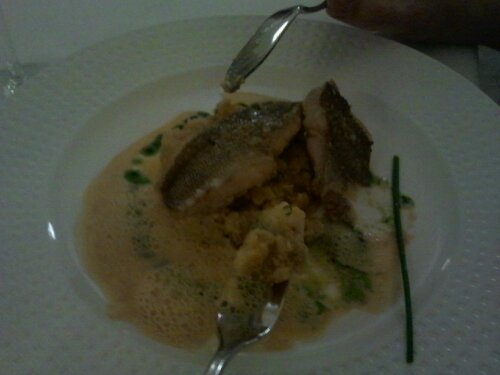
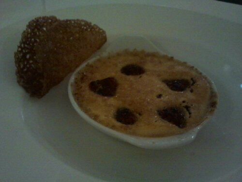
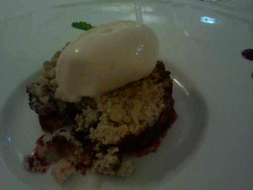
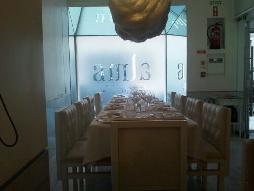

Jantei com dois amigos [aqui](http://alma.co.pt/):

É o restaurante Alma, do chef Henrique Sá Pessoa.

As entradas eram boas, mas em quantidade tão pequena que era difícil provar as restantes sem privar os outros de parte substancial da sua.

Eu comi salmão com micro cubos de pepino e amendoim...

Os meus amigos comeram um gaspacho...

... e salada de gambas...

Quanto à refeição, fomos dois para um excelente magret de pato com manga cortada em pedacinhos do tamanho de milho...

... e um besugo com muito bom aspeto...

Já nas sobremesas, enquanto que eles foram para um leite creme, perdão, créme brulé com framboesas...

... e eu fui para um bolinho de amêndoa com creme de morango e uma bola de gelado de carmudongo que era várias ordens de grandes melhor que o creme...

Isto devidamente acompanhado de bom vinho, menção especial para o Castelo de Alba Reserva de 2009, se bem que era servido em doses de amostra.

Por um lado soube bem  :-)

Só teve dois pontos negativos, um calor que mal se aguentava apesar de na rua não estar quente, e o preço.

Sinto vergonha de confessar que paguei 60€ pela minha parte, mas foram merecidos. Não é, claramente, para frequentar regularmente a quem não tenha saído o Euro-milhões.

Mas foi um tempo bem passado.com os meus amigos numa valente patuscada.  :-)

