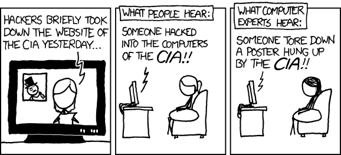

The US government is already fighting wars on several fronts, including the perpetual War on Terror. "War is the health of the state," as Randolph Bourne stated, and the [state has never been healthier](http://archive.mises.org/7992/higgs-war-is-the-health-of-the-state-sickness-of-the-economy/), using this variety of opponents as excuses to increase surveillance, curtail rights and expand power.  
  
[Bruce Schneier highlights a piece written by Molly Sauter for the Atlantic](http://www.cato.org/blog/war-health-state-redux) which poses the question, "[If hackers didn't exist, would the government have to invent them?](http://www.theatlantic.com/technology/archive/12/07/if-hackers-didnt-exist-governments-would-have-to-invent-them/259463/)" The government certainly seems to _need_ some sort of existential hacker threat in order to justify _more_ broadly/badly written laws (on _top_ of the outdated and overbroad CFAA). But the government's portrayal of hackers as "malicious, adolescent techno-wizards, willing and able to do great harm to innocent civilians and society at large," is largely false. If teen techno-wizards aren't taking down site after site, how is all this personal information ending up in hackers' hands? Plain old human carelessness.

> _According to the [Privacy Rights Clearinghouse](https://www.privacyrights.org/data-breach/new), the loss or improper disposal of paper records, portable devices like laptops or memory sticks, and desktop computers have accounted for more than 1,400 data-breach incidents since 2005 -- almost half of all the incidents reported. More than 180,000,000 individual records were compromised in these breaches..._

By comparison, only 631 breaches were attributed to _actual_ hacking, or at least hacking as it's portrayed by the government. Private entities aren't very worried about being hacked either, at least not from the outside. Their main concern, according to the Privacy Rights Clearinghouse, is "inside jobs" by disgruntled employees.  
  
Nonetheless, the narrative advanced by the government (and passed along by the largely credulous mainstream media) of unstoppable hackers and their omnipresent threat to major companies, the government itself, average Americans and underlying infrastructure, continues nearly unimpeded. This narrative is essential to those in the government who wish to justify large-scale surveillance of anything and anyone connected to the internet. The scarier the image, the more it can get away with.

> _It is the hacker -- a sort of modern folk devil who personifies our anxieties about technology -- who gets all the attention. The result is a set of increasingly paranoid and restrictive laws and regulations affecting our abilities to communicate freely and privately online, to use and control our own technology, and which puts users at risk for overzealous prosecutions and invasive electronic search and seizure practices. The Computer Fraud and Abuse Act, the cornerstone of domestic computer-crime legislation, is overly broad and poorly defined. Since its passage in 1986, it has created a pile of confused caselaw and overzealous prosecutions._

We've seen the [overzealous prosecution](http://www.techdirt.com/articles/20130306/13444122220/holder-doj-used-discretion-bullying-swartz-press-lacked-discretion-quoting-facts.shtml) and expressed disbelief and amazement at [some of the interpretations](http://www.techdirt.com/articles/20130406/22004022615/which-ny-times-reporter-jenna-wortham-accidentally-reveals-how-she-violated-both-cfaa-dmca.shtml) of this outdated law. (Amazingly, Sauter's post was written _before_ the most recent cases of overzealous prosecution.) And instead of fixing the CFAA, legislators are actively working to make it worse, even as overly-broad cybersecurity legislation is being negotiated in secret.  
  
The "modern folk devil" image has become part of the mass consciousness. Anonymous and its various offshoots roam the internet, at turns wreaking havoc and helping the oppressed, like an electronic manifestation of [Loki, the Distributed](http://en.wikipedia.org/wiki/Loki). These activities are duly reported by the media in ominous tones, further driving home the image of the hacker at Millennial Public Enemy No. 1. The acts and the perception of the damage caused by this hacking are miles apart, [as is perfectly illustrated by xkcd](http://xkcd.com/932/).

  
Many members of the American public are already convinced something should be done about hackers. Many of our representatives feel the same way. A lack of knowledge of the underlying technology, much less the methods or culture, hasn't deterred legislators from crafting an overbroad response with the CISPA bill. Examining the issues more closely or reconsidering the legislation doesn't seem to be an option. After all, a "[cyber Pearl Harbor](http://www.techdirt.com/articles/20121017/19152520740/defense-secretary-leon-panetta-recycles-his-cyber-pearl-harbor-fud-third-times-charm.shtml)" is all but inevitable, a conclusion confirmed by shouting "HACKER!" in the halls of Congress and hearing it echoed back by like-minded representatives, sympathetich government agencies, the media and a subset of the American public.

> _In the effort to protect society and the state from the ravages of this imagined hacker, the US government has adopted overbroad, vaguely worded laws and regulations which severely undermine internet freedom and threaten the Internet's role as a place of political and creative expression._

The endgame is [more control](http://www.techdirt.com/articles/20111023/02413916479/non-existent-cyber-war-is-nothing-more-than-push-more-government-control.shtml), and the "hacker" provides an ominous, omnipresent threat that, because of the hacker's naturally secretive nature, can neither be confirmed or denied with any veracity. Much like the War on Terror, this War on Hacking takes rights from the American public, carves out huge chunks and sends the gutted remains back to citizens in a package marked "Safety."  
  
  
  
[Permalink](http://www.techdirt.com/articles/20130408/17093022626/greatest-trick-government-ever-pulled-was-convincing-public-hacker-threat-exists.shtml) | [Comments](http://www.techdirt.com/articles/20130408/17093022626/greatest-trick-government-ever-pulled-was-convincing-public-hacker-threat-exists.shtml#comments) | [Email This Story](http://www.techdirt.com/articles/20130408/17093022626/greatest-trick-government-ever-pulled-was-convincing-public-hacker-threat-exists.shtml?op=sharethis)  
  
  
 

 

