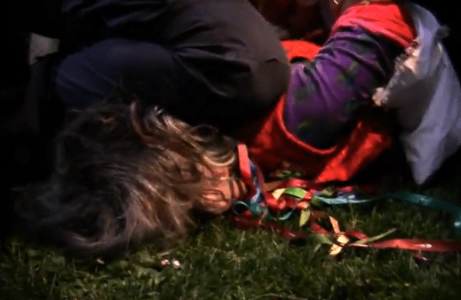

Uma senhora de 50 anos foi detida. Para isso, foram precisos “apenas” 6 agentes. Momentos de tensão em que a PSP tentou repetir o 14 de Novembro.

**O relato é, no mínimo, tenebroso.** Uma manifestante, Fernanda P., com cerca de 50 anos, manifestava-se com uma bandeira de Portugal e estava descansa em frente ao Hotel Ritz.

Aconteceu, segundo relatou um manifestante ao Tugaleaks, “entre as 20:00 e 20:30”. Afirma ainda que “\[a\] polícia queria os manifestantes do outro lado da rua, apesar do Ritz não ser um edifício governamental e portanto não estar abrangido pela regra dos 100m. Ao início as pessoas obedeceram, mas depois começou a haver um avanço em direcção ao Ritz e toda a gente seguiu atrás.”

O que aconteceu foi que a PSP foi “apanhada desprevenida e não conseguiu impedir que os manifestantes atravessassem a rua. Montou então um cordão à pressa e impediu o avanço para a entrada do Ritz. Deu-se então um jogo de puxa-empurra com as faixas nos meio a servirem de terra de ninguém. Finalmente, os polícias receberam reforços e começaram a empurrar com alguma força os manifestantes de volta para o outro lado da rua”.

O mesmo manifestante relata ainda, pois estava perto do que aconteceu, relata o momento da detenção:

> A senhora da bandeira que foi detida circulava atrás do cordão da polícia. Quando se aproximou de forma completamente civil ao cordão policial, dois agentes pegaram nela e começaram a empurrá-la à bruta de volta para junto dos outros manifestantes. Apanhada de surpresa, a senhora defendeu-se com a bandeira, o que os agentes tomaram como uma agressão. Agora, em vez de a empurrar, puxavam-na, enquanto os outros manifestantes a tentavam puxar para junto de si e gritavam aos polícias que “é só uma mulher”.
> 
> Os polícias forçaram-na ao chão e algemaram uma das mãos, virando depois a senhora de barriga para baixo, com um joelho em cima da cabeça, para lhe algemarem a outra mão. **Um espectáculo único, 4 ou 5 polícias de volta de uma senhora descalça de 50 anos.**  
> Depois disso, levantaram-na e foi levada por dois agentes para fora do local.  
> **A senhora não era de todo um perigo. Os agentes estavam era de cabeça quente e precisaram de descarregar em alguém.**

Um vídeo publicado pelo Ministério da Verdade vem confirmar este relato. A pessoa era pacífica. As imagens falam por si, a partir do minuto 2:30, e mostram uma cidadã completamente pacifica.

## Quanto paga “o povo” pela Troika no Ritz?

O Ritz está inserido no grupo [Four Seasons](http://www.fourseasons.com/lisbon/ "http://www.fourseasons.com/lisbon/"). O quarto mais barato é de 345EUR sendo o valor mais alto 2.050EUR. Tendo em conta que são três, no mínimo, as pessoas da Troika que estão em Portugal e que ambas optaram pelo valor mais económico, são mais de mil euros por dia que o povo paga. Não é claro se é o Governo Português a pagar o Hotel ou se é o FMI, mas claro é que este tipo de hotéis e passagens por Portugal estão aquém das possibilidades dos Portugueses.  
**Para todos os efeitos, é preciso dois trabalhadores a trabalhar um mês inteiro com o ordenado mínimo para pagar uma noite de Hotel á Troika.**

Artigos relacionados:

1. [Relato do Protesto Anti-repressão Policial](http://www.tugaleaks.com/protesto-anti-repressao-policial.html "Relato do Protesto Anti-repressão Policial")
2. [Relato sobre confrontos a 22 de Março: agressões, violência policial e abuso de autoridade](http://www.tugaleaks.com/22-de-marco-relato.html "Relato sobre confrontos a 22 de Março: agressões, violência policial e abuso de autoridade")
3. [Protesto à porta do Pingo Doce acaba com a PSP a rasgar cartazes](http://www.tugaleaks.com/protesto-pingo-doce.html "Protesto à porta do Pingo Doce acaba com a PSP a rasgar cartazes")

