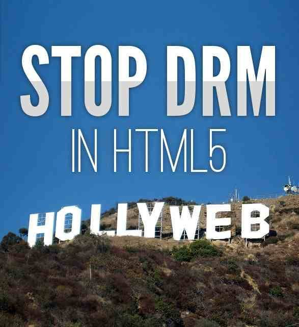

  
Kyre sez, "The Free Culture Foundation has posted a thorough response to the most common and misinformed defenses of the W3C's Extended Media Extensions (EME) proposal to inject DRM into HTML5. They join the EFF and FSF in a call to send a strong message to the W3C that DRM in HTML5 undermines the W3C's self-stated mission to make the benefits of the Web 'available to all people, whatever their hardware, software, network infrastructure, native language, culture, geographical location, or physical or mental ability.' The FCF counters the three most common myths by unpacking some quotes which explain that 1.) DRM is not about protecting copyright. That is a straw man. DRM is about limiting the functionality of devices and selling features back in the form of services. 2.) DRM in HTML5 doesn't obsolete proprietary, platform-specific browser plug-ins; it encourages them. 3.) the Web doesn't need big media; big media needs the Web. There is also [a new coalition](https://www.fsf.org/news/coalition-against-drm-in-html) of 27 internet freedom companies and groups standing up to the W3C."

[Don’t let the myths fool you: the W3C’s plan for DRM in HTML5 is a betrayal to all Web users.](http://freeculture.org/blog/2013/04/23/dont-let-the-myths-fool-you-the-w3cs-plan-for-drm-in-html5-is-a-betrayal-to-all-web-users/) 

<table border="0"><tbody><tr><td valign="middle">&nbsp;&nbsp;&nbsp;&nbsp;</td><td valign="middle"></td></tr></tbody></table>

  
  

