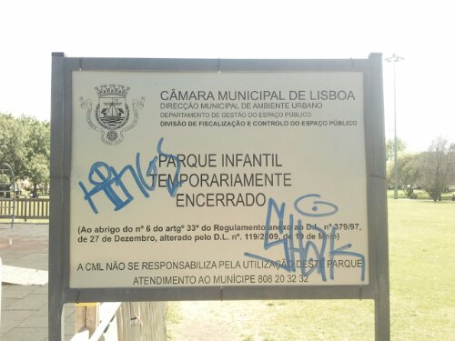
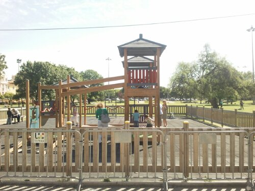
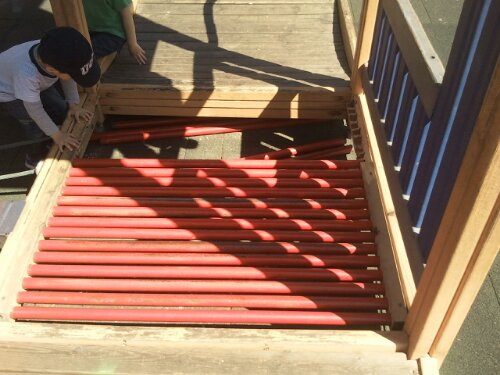
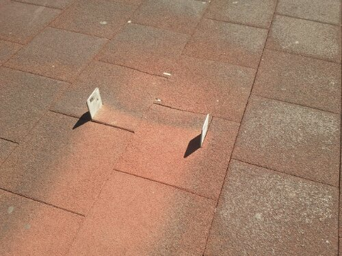
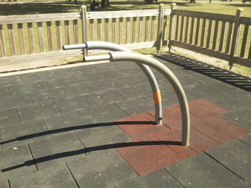
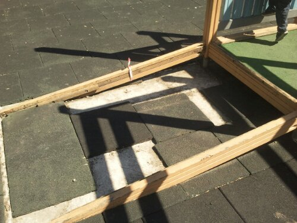

É muito fixe colocar parques infantis num jardim, mas já agora um mínimo de manutenção é necessário ou então mais valia retirar.

Há coisas que neste momento estão atrozes do ponto de vista da segurança da criançada que brinca neste parque nos jardins em Belém, mas como é evidente não é um cartaz a dizer que a Câmara Municipal de Lisboa não se responsabiliza que impede seja quem for de correr riscos desnecessários.

