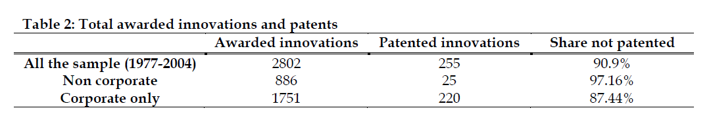
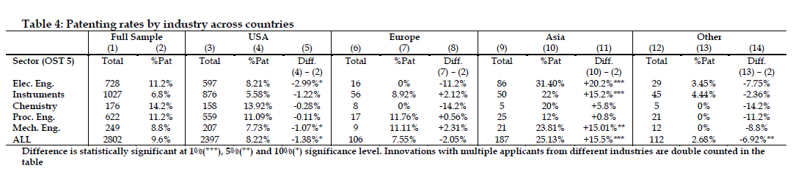

We've pointed out over and over and over again that patents are not a proxy for innovation. In fact, there's little to connect the two at all, except potentially for how patents can _hinder_ and hold back the pace of innovation. A new study really helps to drive home how little patents have to do with innovation. Pointed out to us [by James Bessen](https://twitter.com/JamesBessen/status/328459554528587777), the study looks at "R&D 100 Awards" from the academic journal, _Research & Development_ from 1977 to 2004. As you might expect, the R&D 100 Awards are given out each year by the journal in an attempt to name the top 100 innovations of the year. If patents were instrumental in driving innovation, you'd certainly expect most of these innovations to be patented.  
  
But you'd be wrong, as the reports authors, Roberto Fontana, Alessandro Nuvolari, Hiroshi Shimizu and Andrea Vezzulli, quickly discovered.  
  
A stunning [_91%_ of all of the technologies receiving the prize were not actually patented](http://ideas.repec.org/p/ise/isegwp/wp092013.html). That's covering approximately 3,000 technologies winning this award as the most innovative advancement of the year over a period of about three decades. What's interesting to me is that this actually matches very closely with one of my favorite studies on patents, from economist Petra Moser, who looked at _historical_ patenting rates from the 19th century using data on products displayed at the Crystal Palace exhibition of 1851 and the Centennial exhibition in Philadelphia in 1876, which against showed very few of the "economically useful" inventions were patented. Over 80% were not patented. Of course, you might think that back in the 1800s there was less interest in patenting, but this new study suggests a rather similar rate to what Moser found from 150 years ago.  
  
The R&D 100 certainly seems to be a good way to look at key innovations. It's judged by a distinguished panel of experts, looking at two key criteria: i) technological significance (i.e., whether the product can be considered a major breakthrough from a technical point of view); ii) competitive significance (i.e., how the performance of the product compares to rival solutions available on the market). Both of these would seem like significant indicators of innovation. And, as the authors note, many big innovations can easily be found on the list:

> _Throughout the years, key breakthroughs inventions such as Polacolor film (1963), the flashcube (1965), the automated teller machine (1973), the halogen lamp (1974), the fax machine (1975), the liquid crystal display (1980), the printer (1986), the Kodak Photo CD (1991), the Nicoderm antismoking patch (1992), Taxol anticancer drug (1993), lab on a chip (1996), and HDTV (1998) have received the prize._

Tellingly, even to apply for the award, innovators have to show just how much the innovation was an improvement on what else was available on the market, They have to submit a "competitive matrix" showing this. In other words, these prize-winning innovations tend to be actual innovations in the market that drive the state of the art forward. You could suggest that they are innovations that truly "promote the progress," as (unlike our patent system) to get this award you literally have to show how the innovation promotes further progress.  
  
As you can see from the key findings, very, very little of the innovations that won the prize was also patented either three years before or three years after the prize was awarded:

Even when you take out "non-corporate" innovations (which have less propensity to be patented), looking at corporate only innovations over 87% were not patented.  
  
Of course there are some differences depending on what industry the innovation happened in, as well as where the innovation was originated. The researchers broke down all of that information as well:

As you can see, the US actually has a lower patenting rate than Europe and Asia for the most part, which runs counter to the narrative often being told about how the US's leads the world with our patent system, and that Asian innovators have less respect for patents. Though, on that point, the researchers note that most of the patents in the "Asian" section are Japanese, so it's possible that other countries in Asia, mainly China (along with known tech hubs Taiwan, Hong Kong and Singapore) do, in fact have a much lower propensity to patent.  
  
Of course the point that stood out as most interesting to me was the very low rate of patenting in the "chemistry" industry. This covers pharmaceuticals as well. And, of course, we're always told that this industry really "needs" patents because of the ease of copying as compared to the cost of innovating. That doesn't seem to be supported by the data at all. Yes, it's the highest percentage patented in the US, but still only 14% of such innovations are patented in the US.  
  
All in all, this is a really interesting paper and a significant contribution to the discussion over whether or not patents are really a good judge of innovation. It would seem from the data available that the answer is a very loud "no." In fact, it would appear that very few of the most significant and important innovations are being patented. That should, at the very least, raise considerable questions concerning those who argue that our patent policy is necessary to encourage innovation, or those who argue that numbers from the patent system are a good judge of innovation.  
  
[Permalink](http://www.techdirt.com/blog/innovation/articles/20130502/10513922919/over-90-most-innovative-products-past-few-decades-were-not-patented.shtml) | [Comments](http://www.techdirt.com/blog/innovation/articles/20130502/10513922919/over-90-most-innovative-products-past-few-decades-were-not-patented.shtml#comments) | [Email This Story](http://www.techdirt.com/blog/innovation/articles/20130502/10513922919/over-90-most-innovative-products-past-few-decades-were-not-patented.shtml?op=sharethis)  
  
  
 

 

