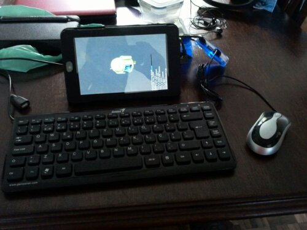

How ridiculous this feels. An android tablet, Google Nexus 7, with a mini male to normal female USB adapter connected to an USB hub, where I connected a mouse and keyboard (because typing with the mouse is an even worse experience than typing with your finger, even with slide typing).

Today, from one hour into the other, I don't know how but the screen broke in two cracks, it's then three pieces and only the smallest one has touch, which I deduce it's where it connects with the PCB.

At least this setup allowed me to make a last second full backup before wiping to factory defaults and send to insurance.

I hope it doesn't last long before I get it back, I'm already with shivers due to abstinence...
