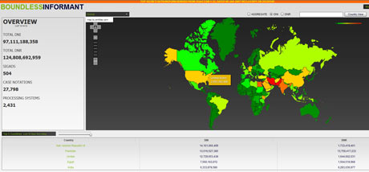

And... yet another leak of NSA surveillance capabilities to The Guardian's Glenn Greenwald (who damn well better get a Pulitzer Prize for this) suggests pretty strongly that [the NSA has directly lied, multiple times, when asked to disclose](http://www.guardian.co.uk/world/2013/jun/08/nsa-boundless-informant-global-datamining?CMP=twt_gu) how many people it had spied on in the US. As we've noted for a while, the NSA has claimed that it [was not possible](http://www.techdirt.com/articles/20110728/02210915297/intelligence-chief-to-wyden-it-would-be-difficult-to-reveal-what-you-want-us-to-reveal-because-we-dont-want-to-reveal-it.shtml) to determine how many Americans it had data on. In a letter to Senator Ron Wyden, Director of National Intelligence James Clapper had stated:

> _While it is not reasonably possible to identify the number of people located in the United States whose communications may have been reviewed..._

An NSA spokesperson also said that it was not possible to figure that out:

> _Judith Emmel, an NSA spokeswoman, told the Guardian in a response to the latest disclosures: "NSA has consistently reported – including to Congress – that we do not have the ability to determine with certainty the identity or location of all communicants within a given communication. That remains the case."_

But, as Greenwald reveals, the NSA appears to have a program, called Boundless Informant (quite a name, huh) that does **exactly that**.

The leaks are coming fast and furious at this point, and I doubt they're going to stop soon.  
  
[Permalink](http://www.techdirt.com/articles/20130608/12384123379/yet-another-leak-shows-nsa-lied-about-not-being-able-to-geolocate-data-it-scoops-up.shtml) | [Comments](http://www.techdirt.com/articles/20130608/12384123379/yet-another-leak-shows-nsa-lied-about-not-being-able-to-geolocate-data-it-scoops-up.shtml#comments) | [Email This Story](http://www.techdirt.com/articles/20130608/12384123379/yet-another-leak-shows-nsa-lied-about-not-being-able-to-geolocate-data-it-scoops-up.shtml?op=sharethis)  

 

