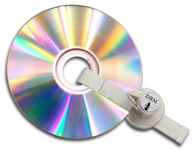

Dois Projetos de Lei, do BE e do PCP, foram ontem aprovados na AR. A sua finalidade é permitir a cópia privada de obras protegidas.

Os downloads não vão aumentar. Esta também não é uma lei sobre pirataria. Trata-se de deixar de ser crime quem, para fins legais, contornar os mecanismos anti –cópia (DRM) que muito se vêm hoje em dia no mercado. Isto não só acontece na música mas também em jogos e em livros digitais.

O Tugaleaks foi entrevistar Marcos Marado, vice-presidente da ANSOL, que explica um pouco este processo.

Imagem: [Esquerda.net](http://www.esquerda.net/artigo/projeto-de-lei-do-bloco-sobre-drm-%C3%A9-aprovado/28238 "http://www.esquerda.net/artigo/projeto-de-lei-do-bloco-sobre-drm-%C3%A9-aprovado/28238")

## Como considerava a ANSOL esta proposta do BE?

Os Projectos de Lei nº 406/XII/2.ª (BE) e nº 423/XII/2.ª (PCP), aprovados hoje na generalidade pela Assembleia da República, ambos com os votos favoráveis dos Grupos Parlamentares do PS, PCP, BE e PEV, e com a abstenção dos Grupos Parlamentares do PPD/PSD e do CDS-PP, baixando assim à 1.ª Comissão para discussão na especialidade, são, ambos, muito favoráveis à correcção de um erro no actual Código de Direito de Autor e Direitos Conexos (CDADC), correcção essa pela qual a ANSOL tem lutado desde 2004, altura em que o erro foi inserido na Legislação.  
O CDADC prevê um conjunto de direitos aos cidadãos, designados como “ultilizações livres”, e que permitem acções como poder fazer a cópia privada de uma obra, a utilização de excertos de uma obra para fins educacionais, etc.. Mas o mesmo CDADC dita como ilegal qualquer quebra de tecnologias digitais de restrição (os DRM), pelo que se um utilizador tiver, por exemplo, um DVD com DRM, fica impedido de usufruir das utilizações livres e fazer uma cópia desse DVD para o teu tablet, e um professor fica sem o direito de poder copiar um excerto desse DVD para o exibir numa sala de aula. Para resolver esse conflito, o actual CDADC prevê um mecanismo de obtenção do conteúdo: o cidadão deve pedir à IGAC os meios que lhe permitam efectuar a referida cópia. Na prática, a IGAC não tem esses meios nem como os dar ao cidadão.  
O essencial dos Projectos de Lei ontem aprovados na generalidade é a resolução desta falha no actual CDADC, que impede efectivamente os cidadãos de exercerem os seus direitos, passando a permitir a quebra de DRM, quando esta é feita para fins legais.  
Assim sendo, foi com muito agrado que a ANSOL viu estes Projectos de Lei finalmente aparecerem, e apelou a todos os Grupos Parlamentares para que os aprovassem, o que felizmente veio a acontecer.

**Link: [Mais informações sobre a interpretação da ANSOl desta matéria](http://tinyurl.com/drmpt-PL-2013 "http://tinyurl.com/drmpt-PL-2013")**

## O que significa na prática esta aprovação?

Esta aprovação é um primeiro passo, essencial, para a resolução do problema dos DRM em Portugal. Os Projectos de Lei baixam agora à 1ª Comissão, a quem a ANSOL já comunicou o seu interesse em participar nos trabalhos que se avizinham, para que possam ser discutidos na especialidade. É de esperar que desses trabalhos resulte um único Projecto final, cuja redacção será elaborada em sede da referida Comissão, que será posteriormente votado pela Assembleia da República.  
É de esperar que, na essência, os Projectos não mudem, mas muitos dos promenores envolvidos gerão concerteza debate. Acreditamos ser consensual que o actual CDADC não funciona no que diz respeito aos direitos dos cidadãos quando uma obra tem DRM, e que isso se verterá no documento final, que, acreditamos também, será posteriormente aprovado no Parlamento. Existem, contudo, vários promenores em cada um dos Projectos Lei que poderão não ser tão consensuais: uma audição atenta ao debate sobre estes Projectos de Lei (que pode ser visto em [http://www.youtube.com/watch?v=BsiyqjiktVU](http://www.youtube.com/watch?v=BsiyqjiktVU "http://www.youtube.com/watch?v=BsiyqjiktVU") ) mostram-nos que tanto PPD/PSD como PS e CDS-PP defendem que existem melhoramentos a serem feitos a estes projectos.

Para os que não conhecem, o que é e como se identifica o DRM?  
Infelizmente as obras comercializadas com DRM raramente estão identificadas como tal. Com o objectivo de ajudar todos aqueles que quiserem saber identificar ou memso evitar estas obras, existe um pequeno guia (em constante actualização) em https://drm-pt.info/como-descobrir-drm/

## A ANSOL já teve outras posições e acções sobre o DRM. Pode enumerar algumas?

A ANSOL foi criada em 2001, o mesmo ano em que foi aprovada a directiva comunitária 2001/29/EC que obriga os Estados-Membro a proteger legalmente os DRM. E foi logo desde o início da Associação que temos levado a público as nossas preocupações nesta matéria: relembro o conjunto de dois artigos publicados em 2002 sobre a matéria no jornal Expresso, em que a ANSOL fala dos problemas causados por esta protecção legal, e que a GDA diz, sobre esta matéria, “É possível que, neste particular, o sempre procurado equilíbrio entre direitos e interesses se tenha partido”. Foi também em 2002 que começou o trabalho de transposição da referida directiva para a legislação nacional, e a ANSOL acompanhou e trabalhou junto com o Gabinete do Direito de Autor mo sentido de melhorar o Projecto-Lei inicial, e este trabalho desenvolveu-se ao longo de dois anos, tendo culminado na Proposta de Lei nº 108/IX, tornada Lei naquele que é o actual CDADC. Considerando o trabalho desempenhado na altura de frutuoso, mas ainda assim insuficiente (como podemos hoje constatar, com as falhas já referidas), a ANSOL continuou a trabalhar este tema, dando palestras e fazendo apresentações sobre o tema – que ganhou mais atenção do público em 2005 aquando do [caso mediático do rootkit da Sony](http://en.wikipedia.org/wiki/Sony_BMG_copy_protection_rootkit_scanda "http://en.wikipedia.org/wiki/Sony_BMG_copy_protection_rootkit_scanda") - divulgando informação, celebrando o Dia Contra o DRM anualmente, desde 2006, e acabando por criar a [iniciativa DRM-PT](http://drm-pt.info%20/ "http://drm-pt.info ") em 2007.

## Acha que a cópia de CDs e DVDs vai aumentar?

Não nos parece previsível que haja um aumento substancial no número de cópias efectuadas: uma das ilações que se podem tirar tanto do reduzido número de pedidos dos meios para neutralizar o DRM à IGAC como das iterações e pedidos de informação que a ANSOL tem recebido ao longo dos anos é que os cidadãos hoje em dia já fazem estas cópias, mesmo que de forma ilegal. Lembro-me, a título de exemplo, do cidadão que queria imprimir um documento público, disponibilizado por um serviço governamental em formato PDF, que tinha DRM que prevenia a sua impressão, ou a quantidade de guias de como retirar o DRM dos ebooks comprados no Kindle para poderem ser lidos noutros leitores. E não digo com isto que as pessoas optam por não cumprir a Lei – na maioria das vezes elas não sabem que aquilo que estão a fazer lhes pode dar uma pena de prisão. Recordo-me até de, num evento recente, ao ter sido levantada a questão da cópia privada de uma obra com DRM por uma representante da AEL, um advogado presente no debate dizer “quer fazer a cópia faça, ninguém vai levá-la a tribunal!”.

## Aceder aos documentos:

## [Projecto de Lei nº 406/XII/2.ª  
](http://www.parlamento.pt/ActividadeParlamentar/Paginas/DetalheIniciativa.aspx?BID=37676 "\http://www.parlamento.pt/ActividadeParlamentar/Paginas/DetalheIniciativa.aspx?BID=37676")[Projeacto de Lei nº 423/XII/2.ª](http://www.parlamento.pt/ActividadeParlamentar/Paginas/DetalheIniciativa.aspx?BID=37773 "http://www.parlamento.pt/ActividadeParlamentar/Paginas/DetalheIniciativa.aspx?BID=37773")

Artigos relacionados:

1. [Cópia do Julgamento de Assange disponível no Tugaleaks](http://www.tugaleaks.com/copia-julgamento-assange.html "Cópia do Julgamento de Assange disponível no Tugaleaks")
2. [Proposta “confidencial” sobre a alteração da Cópia Privada acaba leakada na Internet](http://www.tugaleaks.com/proposta-alteracao-copia-privada.html "Proposta “confidencial” sobre a alteração da Cópia Privada acaba leakada na Internet")
3. [O ACTA perdeu a votação na Europa mas pode ainda vir a assombrar a Internet](http://www.tugaleaks.com/acta-europa-votacao.html "O ACTA perdeu a votação na Europa mas pode ainda vir a assombrar a Internet")

