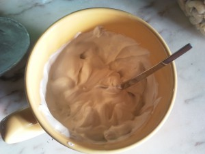

My current favorite breakfast is not for the faint of heart, or those who favor carbon hydrates and demonize fat.

I start the night before, by using a strainer to drain the serum off my sugarless greek yogurt all night in the fridge until it gets the consistency of cream cheese.

 In the morning, the serum is on the cup, and you can safely throw it away, together with the little carbon hydrates the yogurt had.

Don't worry using a spoon to take it off the strainer, turn it over and give it a dry impact on the cup.

 

... And it'll just fall off in it.

Then I add half a cup of thick cream (30% fat, more would be better, but I can't find it in Portugal) and mix it even.

One can see how hard it is, the spoon just won't fall off!

Then I finish by adding some nuts, blueberries, etc... Today I only had cashew, pistachios and almonds.

 Yummy, and I get to go up until lunch without needing to eat in the between.

Hope you enjoyed it!
