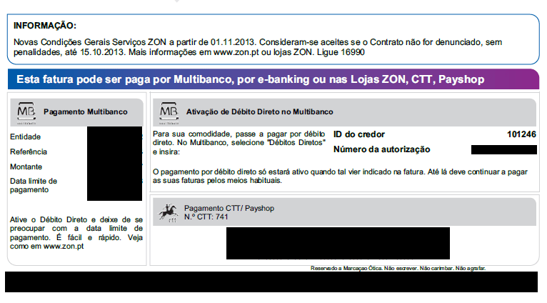

Article note: Está na altura de rever o meu contrato com a ZON...

Recentemente a ZON alterou e informou os clientes de novas condições contratuais. Embora estejam a ser criados alguns entraves, é possível desistir dos serviços subscritos.

A ZON alterou as suas condições contratuais. Na factura de Setembro, podemos ler a seguinte frase: “Novas Condições Gerais Serviços ZON a partir de 01.11.2013. Consideram-se aceites se o Contrato não for denunciado, sem penalidades, até 15.10.2013.”.

O texto, que parece bastante simples, pode deixar algumas pessoas confusas. O Tugaleaks foi esclarecer a questão.

Foram efectuadas três chamadas para o Serviço de Apoio a Clientes ZON por três Clientes ZON, um deles ZON Empresas (a redacção do Tugaleaks). Destas, todas ouvidas pelo nosso órgão de comunicação social em tempo real, obtivemos as seguintes conclusões:  
**Chamada #**1 – conta da redacção do Tugaleaks, ZON Empresas – Após explicar o propósito da nossa chamada, o operador de nada sabia. Confrontado com a questão da informação na factura, confirmou a nossa possibilidade de desistir mesmo tendo fidelização.  
**Chamada #2** – Cliente Particular sem IRIS – Cliente efectua chamada e diz que está descontente com as novas condições no site e dá como exemplo o ponto da Política de Utilização Aceitável. Operador informa que não é possível rescindir sem pagar fidelização. Cliente informa que na factura diz que “sem penalidades” e, depois de algumas trocas de opiniões, operador confirma possibilidade de desistir em período de fidelização.  
**Chamada #3** – Cliente Particular com IRIS – Cliente diz que não pretende novas condições, operador alega fidelização e cliente mantém-se com serviço sem fazer qualquer insistência.

O Tugaleaks chegou ainda ao contacto com um operador do callcenter da ZON em Lisboa, que afirmou, sob anonimato, que “apenas se os clientes falaram na mensagem da factura é que lhe podemos indicar que podem desistir, mas temos sempre que insistir com o cliente e tentar baixar custos”.

Tentámos também contactar a [ANACOM](http://www.anacom.pt/ "http://www.anacom.pt"), que, até ao momento, não prestou esclarecimentos sobre esta informação

Por outro lado, a Direcção Central de Comunicação e Conteúdos Multimédia da ZON explicou-nos que “na generalidade, as alterações são transposições de alterações legais ocorridas e são favoráveis aos clientes” e que “comunicámos as alterações aos clientes em estrita obediência ao que o nº.6 do artº.48º, nº.6 da lei das comunicações eletrónicas e no respeito pelos direitos dos clientes”. Em relação ao período de fidelização, informam que “no nosso entendimento, o disposto no nº.7 do artigo 48º da lei das comunicações eletrónicas salvaguarda os períodos de fidelização, o regime das contrapartidas previstas para a rescisão antecipada, pelos assinantes, dos contratos que estabelecem períodos contratuais mínimos“.

O referido artigo, indicado pela ZON, [indica que](http://dre.tretas.org/dre/286034/ "http://dre.tretas.org/dre/286034/") “O disposto no número anterior não se aplica às alterações contratuais em que seja possível identificar uma vantagem objectiva para o assinante nem afasta o regime de contrapartidas previstas para a rescisão antecipada, pelos assinantes, dos contratos que estabelecem períodos contratuais mínimos”.

## Será que existe uma “vantagem objectiva”?

A lista de alterações efectuadas pela ZON coloca uma política de utilização aceitável (conhecida como PUA) nos clientes bem como outras alterações que podem não ser benéficas para os clientes, nomeadamente os seguintes pontos que passam a constar das condições contratuais:

\- 1.5 Ao efetuar o pagamento da primeira fatura, o Cliente aceita, reconhece e confirma que subscreveu os Serviços e Produtos constantes da mesma, os quais são prestados de acordo com as Condições dos Produtos e Serviços ZON.  
\- 8.3 Decorrido o prazo adicional de 30 (trinta) dias referido no número anterior, sem que o Cliente tenha efetuado o pagamento da fatura ou celebrado com a ZON qualquer acordo de pagamento por escrito, a ZON procederá, no prazo de 10 dias após o final do prazo adicional, à suspensão dos Serviços por um período de 30 (trinta) dias.  
\- 8.7 A suspensão do acesso aos Produtos e Serviços prevista nas alíneas (b) a (f) da Cláusula 8.1 será efetuada pela ZON mediante notificação ao Cliente, com uma antecedência mínima de 24 (vinte e quatro) horas, salvo em caso de emergência ou força maior, caso em que a suspensão poderá preceder a comunicação, que será efetuada logo que possível.  
\- 6.2 O Cliente reconhece e aceita que caso sejam efetuados consumos no âmbito dos Serviços que excedam significativamente os seus níveis habituais de consumo, a ZON poderá, a qualquer momento, exigir o pagamento dos serviços em causa.

Existem ainda casos de sucesso no Fórum ZWAME no tópico “[Clientes ZON podem rescindir livremente até 15 de Novembro](http://forum.zwame.pt/showthread.php?t=818446 "http://forum.zwame.pt/showthread.php?t=818446")”, onde os serviços já foram inclusivamente rescindidos e alegadamente sem penalizações. O que leva a perguntar, perante o comentário da ZON e as chamadas efetuadas: qual dos lados está correcto?

Se não concorda com estas condições, lembre-se: **terá que indicar expressamente a sua não concordância e se possível especificar um dos pontos com os quais não concorda.**

Artigos relacionados:

1. [Infografia da Wikileaks para quem não sabe (e mesmo para quem sabe) – por @PauloQuerido](http://www.tugaleaks.com/infografia-da-wikileaks-para-quem-nao-sabe-e-mesmo-para-quem-sabe-por-pauloquerido.html "Infografia da Wikileaks para quem não sabe (e mesmo para quem sabe) – por @PauloQuerido")
2. [AR não divulga dados sobre quem recebe o quê em termos de pensões vitalícias](http://www.tugaleaks.com/ar-pensoes-vitalicias.html "AR não divulga dados sobre quem recebe o quê em termos de pensões vitalícias")
3. [Anonymous detidos em Itália – #OpItaly](http://www.tugaleaks.com/anonymous-detidos-em-italia-opitaly.html "Anonymous detidos em Itália – #OpItaly")

