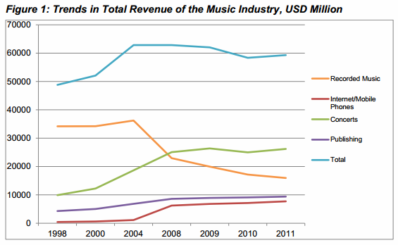

Over the past years there have been ample research reports showing that file-sharing can have positive effects on the entertainment industries.

Industry lobbyists are often quick to dismiss these findings as incidents or weak research, and counter them with expensive studies they have commissioned themselves.

The London School of Economics and Political Science ([LSE](http://www.lse.ac.uk/home.aspx)) jumps into the discussion this week with a media policy brief urging the UK Government to look beyond the reports lobbyists hand to them. [Their report](http://www.scribd.com/doc/172985274/LSE-MPP-Policy-Brief-9-Copyright-and-Creation) concludes that the entertainment industry isn’t devastated by piracy, and that sharing of culture has several benefits.

“Contrary to the industry claims, the music industry is not in terminal decline, but still holding ground and showing healthy profits. Revenues from digital sales, subscription services, streaming and live performances compensate for the decline in revenues from the sale of CDs or records,” says Bart Cammaerts, LSE Senior Lecturer and one of the report’s authors.

The report shows that the entertainment industries are actually doing quite well. The digital gaming industry is thriving, the publishing sector is stable, and the U.S. film industry is breaking record after record.

“Despite the Motion Picture Association of America’s (MPAA) claim that online piracy is devastating the movie industry, Hollywood achieved record-breaking global box office revenues of $35 billion in 2012, a 6% increase over 2011,” the report reads.

Even the music industry is doing relatively well. Revenue from concerts, publishing and digital sales has increased significantly since the early 2000s and while recorded music revenues show a decline, there is little evidence that piracy is the lead cause.

“The music industry may be stagnating, but the drastic decline in revenues warned of by the lobby associations of record labels is not in evidence,” the report concludes.

  

##### Music industry revenue

The authors further argue that file-sharing can actually benefit the creative industries in various ways.

The report mentions the success of the SoundCloud service where artists can share their work for free through Creative Commons licenses, the promotional effect of YouTube where copyrighted songs are shared to promote sales, and the fact that research shows that file-sharers actually [spend more money](http://torrentfreak.com/uk-movie-pirates-spend-way-more-at-the-box-office-121122/) on entertainment than those who don’t share.

“Within the creative industries there is a variety of views on the best way to benefit from online sharing practices, and how to innovate to generate revenue streams in ways that do not fit within the existing copyright enforcement regime,” the authors write.

Finally, the report shows that punitive enforcement strategies such as the three strikes law in France are not as effective as the entertainment industries claim.

The researchers hope that the U.K. Government will review the Digital Economy Act in this light, and make sure that it will take into account the interests of both the public and copyright holders.

This means expanding fair use and private copying exceptions for citizens, while targeting enforcement on businesses rather than individuals.

“We recommend a review of the DEA and related legislation that strikes a healthy balance among the interests of a range of stakeholders including those in the creative industries, Internet Service Providers and internet users.”

“When both \[the creative industries and citizens\] can exploit the full potential of the internet, this will maximize innovative content creation for the benefit of all stakeholders,” the authors write.

Source: [Piracy Isn’t Killing The Entertainment Industry, Scholars Show](http://torrentfreak.com/piracy-isnt-hurting-the-entertainment-industry-121003/)

 

