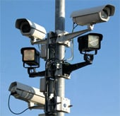

The copyright monopoly debate started with an assertion from the monopolists that “no artist can make money without having a complete monopoly on every form of distribution”.

This is obviously false, most easily observed by looking at the millions of works under Creative Commons licenses, where artists have renounced their already-awarded copyright monopoly rights.

When this is pointed out to copyright monopoly fundamentalists, who begrudgingly have to admit the existence of Creative Commons, they frequently shift stances and say it should be up to every individual creator what distribution they would allow of their book, painting, or guitar piece. They argue that the “distribution control of the author” is some kind of right that has no side effects at all.

Few things could be more deranged and out of touch with reality.

**Today, noncommercial distribution of works under the copyright monopoly take place in our private communications, intermixed with our most private data that leave and arrive at our devices. You can’t tell one type of data from the other without looking at all of it, so the only way to discover copyright monopoly violations is by mass wiretapping and mass surveillance.**

This means that enforcement of the copyright monopoly has become mutually exclusive with private communications as a concept, which is why the copyright monopoly must take a rather large step back into brain-undamaged territory.

This means that allowing every author to control distribution of their book – including me and my swarm leadership book [Swarmwise](http://falkvinge.net/books/) – would give each and every one of those authors the right to wiretap and censor every individual on the planet. That’s the very real, and very insane, consequence.

Let’s take that again, because it is key to the whole copyright monopoly debate today: it was never about the money, it was about the fact that you can’t enforce the copyright monopoly without mass wiretapping, censorship, and intrusive mass surveillance. This is also why you see the copyright industry relentlessly pushing for just that – for example, when they sued Eircom for the right to install the copyright industry’s wiretapping and censorship equipment in the deepest of the Irish internet hubs. The audacity, it burns!

You cannot say that freedom of speech and the secrecy of private correspondence applies to some types of data (mail, surfing, communications) but not to other types (transmissions of works under copyright monopoly), because the only way to tell which is which is to break the secret of correspondence in the first place. You can’t tell if the contents of a letter is legal or illegal without opening it, reading it, and sorting it based on your findings. This monopoly enforcement breaks centuries of civil liberties.

This is also why the common and dismissive counter-argument from copyright monopolists along the lines of “you’re just spoiled brats who don’t want to pay” is such an enraging insult. In Sweden, there’s a saying that “the mouth speaks of what fills the mind”. Monopolists may only care about money, but I don’t care about that and I never did – the copyright monopoly conflict was always a deep civil liberties issue, where the monopoly has become incompatible with fundamental civil liberties for the entire online generation.

Therefore, the copyright monopoly needs to give way.

**The copyright monopoly needs to be permanently and irrevocably scaled back in legislation. Until it is, it is everybody’s duty to undermine it in favor of the communications secret and freedom of speech that have always covered private communications.**

In the words of the Freenet philosophy: “You cannot have both copyright monopoly enforcement and freedom of speech. Therefore, any technology designed to promote and protect freedom of speech must by necessity prevent copyright monopoly enforcement.”

### 

About The Author

Rick Falkvinge is a regular columnist on TorrentFreak, sharing his thoughts every other week. He is the founder of the Swedish and first Pirate Party, a whisky aficionado, and a low-altitude motorcycle pilot. His blog at [falkvinge.net](http://falkvinge.net/) focuses on information policy.

Book Falkvinge [as speaker](http://falkvinge.net/keynotes/)?

[Follow @Falkvinge](http://twitter.com/Falkvinge)

Source: [The Copyright Monopoly Can Only Be Enforced With Mass Wiretapping, And Must Therefore Be Torpedoed](http://torrentfreak.com/copyright-monopoly-must-be-torpedoed-131013/)

 

