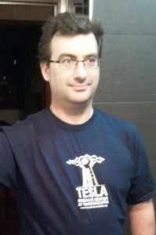
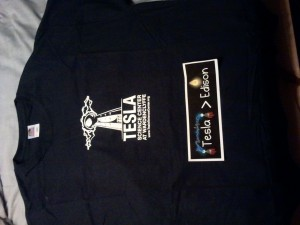
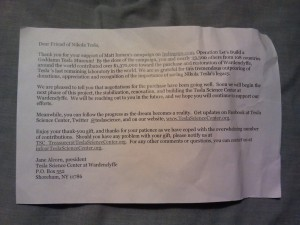

I helped support the [Let's Build a Goddamn Tesla Museum](http://www.indiegogo.com/projects/let-s-build-a-goddamn-tesla-museum--5) campaign raised by [Matthew Innman](theoatmeal.com) on [IndieGoGo](http://www.indiegogo.com/), last year, with 50 $USD with the t-shirt and sticker perks. Estimated to arrive on October 2012 but... I was one of the few unlucky ones who had to wait a bit longer. More than one year longer :)

But I'm not sad, I'm happy the campaign succeeded at almost double the goal, which ensured the creation of the [Tesla Science Center at Wardenclyffe](http://en.wikipedia.org/wiki/Tesla_Science_Center_at_Wardenclyffe) and today I'm super happy the perks arrived.

The sticker will go to my future laptop, I'm keeping it in a safe place until I can afford it, and I couldn't resist taking a quick _pic or didn't happen_ :)

