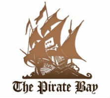

Article note: I've been saying this for a few years, why not some sort of P2P https? :-)

The world’s leading entertainment companies and their armies of lawyers have tried pretty much every trick in the book to take The Pirate Bay offline.

Their numerous attacks have included police raids, the total confiscation of the site’s hardware, plus prolonged legal action resulting in the criminal convictions for its founders. More recently the site’s domains have been blocked in various countries around Europe but no tactic has yet managed to bring the site to its knees.

There have been small victories, however. Perhaps realizing that blockades weren’t having the desired effect in the past year action has been taken against the site’s domains. Fearing a domain seizure by Swedish authorities, last April the site moved to a Greenland-based domain. The stay was short-lived, with the site moving first to Iceland and then the [.sx ccTLD for Sint Maarten](http://torrentfreak.com/the-pirate-bay-moves-to-sx-as-prosecutor-files-motion-to-seize-domains-130430/).

That residency was to last just eight months, terminated this week following pressure from Dutch anti-piracy outfit BREIN. The .AC ccTLD of Ascension Island was [next up](http://torrentfreak.com/the-pirate-bay-moves-to-ac-after-domain-name-seizure-131210/), a handy stopover on the way to its latest destination.

As of a few minutes ago the site’s new domain became ThePirateBay.pe. The .PE represents the ccTLD of Peru, chosen by the site “because it’s in South America.”

Quite how long the world’s most famous torrent site will stay sandwiched between Ecuador and Bolivia is anyone’s guess, but TorrentFreak was told that there will soon come a time when seizing Pirate Bay’s domains will be a pointless exercise.

Currently under development is a BitTorrent-powered browser that will enable users to store and distribute The Pirate Bay and other sites without need for central hosting. This means sites will be able to exist in a new and decentralized form with no reliance on a public-facing website.

In a message to “BREIN and friends,” The Pirate Bay cautions that while closing down domains may be an irritant today, that loophole won’t be open forever.

“They should wait for our new PirateBrowser, then domains will be irrelevant,” an insider told TorrentFreak.

“Once that is available then all links and sites will be accessible through a perfectly legal piece of browser software and the rest of it will be P2P, with no central point to attack via the legal system.”

And according to the spokesman this process of attack and adaption, such as Pirate Bay’s [move to the cloud](http://torrentfreak.com/pirate-bay-moves-to-the-cloud-becomes-raid-proof-121017/) last year, is leading to one place – the advent of new and hardened file-sharing networks.

“By their actions they finally brought on the next generation of decentralized services,” the insider concludes.

TorrentFreak is informed that the new system, which is still under development, will appear as a standalone browser and also as Firefox and Chrome plugins. Until then the varied climate of Peru will suffice.

Source: [TorrentFreak](http://torrentfreak.com/), for the latest info on [copyright](http://torrentfreak.com/category/copyright-issues/), [file-sharing](http://torrentfreak.com/category/pirate-talk/) and [VPN services](http://torrentfreak.com/vpn-services-that-take-your-anonymity-seriously-2013-edition-130302/).

 

