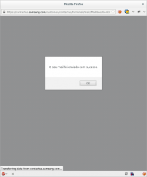

So you might know I bough a Samsung NP900X3C. Yes, it came with Windows. No I don't use it. Yes I want my money back on that item.

I've just asked Samsung Portugal what the procedure is.

> Boa noite,
> 
> Adquiri um portátil NP900X3C e não utilizo Windows. Desejo devolver a licença de Windows que fui forçado a adquirir na compra do portátil em causa, bem como de todos os softwares incluídos no sistema operativo a devolver.
> 
> Desde que o arranquei pela primeira vez que corre GNU/Linux, neste momento Fedora e encontro-me muito satisfeito com o suporte, mas não concordo com a licença do Windows nem posso ser, legalmente, forçado a aceitá-la para comprar um portátil.
> 
> Como devo proceder?
> 
> Obrigado em avanço, Rui Seabra

