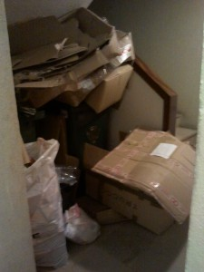

So the City Hall of Lisboa decided to dedicate some days of the week to pick up different kinds of trash. Two days it's plastic, once a week it's paper, and three times it's common garbage. Glass is still deposited on the street containers, but the rest is on dedicated baskets per building.

In our's, on the 3rd sub level, are two baskets. One for paper and one for plastics. As I went there this morning to put some papers in its basket I saw this deplorable scene, showing that one neighbor in particular is **very** disrespectful not only of his neighbors, but also of the poor guy who has to take the baskets out.

  I scrubbed the card boxes until I found two with the address of the culprit, wrote him a message and placed it in his inbox, falling out for all to see.

The messages goes like this:

> Like it? Neither do we!
> 
> Garbage in volume is picked at no cost by the city hall! 217706030
> 
> Meanwhile, use your basement storeroom or your **house** to store the crap you made on -3

