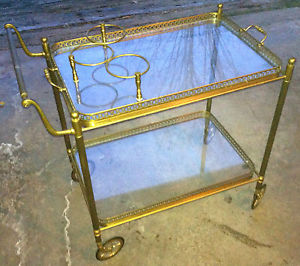

I once had in my house a two level glassy serving cart. Nothing as fancy as this 1000 $ USD, but it was of that fashion:

Now imagine your cat used to run and jump on the top level.

Now imagine the top level had broken, it was being replaced **and** the cat didn't know about it...

Now imagine the cat running, jumping to the top, and then landing **very** surprised on the bottom.

While I was rolling on the floor laughing a lot, the cat stood still some good couple of minutes trying to digest what had just happened.

I miss you, Roque :)
