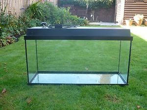

My current cat, Hastur, likes to run from one end of the house to the other.

I had a huge turtle living in a 100 l aquarium, a bit like this one:

The top was usually on, and the cat liked to jump onto it, but one day, it was being cleaned.

The cat jumped and... didn't get wet.

But I had to carefully save him while laughing like a maniac.

He had his 4 members spread out horizontally in order to prevent him from falling and meowed desperately.
