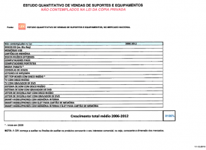

A Agência para a Cópia Privada, AGECOP, ou rendeiros mor, [foi ao Parlamento apresentar à CECC](http://www.parlamento.pt/ActividadeParlamentar/Paginas/DetalheAudiencia.aspx?BID=96644) a sua [lista de presentes](http://app.parlamento.pt/webutils/docs/doc.PDF?path=6148523063446f764c324679626d56304c334e706447567a4c31684a5355786c5a793944543030764f454e4651304d765247396a6457316c626e52766330466a64476c32615752685a4756446232317063334e68627938785a6a4e684f5759344d79307a4d324e6b4c54513259575174596a426b4d5330314d7a6b354d6a46694e445a694e57517555455247&fich=1f3a9f83-33cd-46ad-b0d1-539921b46b5d.PDF&Inline=true) que enviou ao Pai Natal:

- discos hd (bluray \[virgens, para gravação\])
- **memórias USB**
- **cartões de memória**
- **discos rígidos externos**
- **computadores fixos**
- **computadores portáteis**
- **tablets**
- **consolas de jogos**
- leitores mp3/mp4
- set-top boxes com disco rígido
- tv com disco rígido
- tv com gravador de dvd
- sistema de som com disco rígido
- sistema de som com gravador de dvd
- leitor de dvd/blue-ray com disco rígido
- leitor de dvd/blue-ray comgravador de dvd
- **smart-mobilephones** com memória interna
- **smart-mobilephones** com slot para cartão de memória
- **smart-mobilephones** com memória interna e com slot para cartão de memória

A lógica destes rendeiros é que já que a renda à base de DVD's, CD's, cassetes áudio e vídeo diminuiu 90% e a lista acima aumentou 8000%, então sentem-se muito injustiçados e pretendem expandir a renda para passar a incluir aparelhos (a negrito) cuja capacidade de armazenar cópias privadas não passa de um mero acaso derivado de que no mundo digital tudo são ficheiros e que está longe de ser a função principal dos mesmos. É negligenciável e apenas tem cabimento na ganância.

Sobre os restantes (não negrito) não se pode dizer que a possibilidade de armazenar ou realizar cópias privadas seja negligenciável, mas ainda assim está longe de ser a principal.

Em suma,

> Querido Pai Natal,
> 
> A renda que nos deu em 2004 não chega, queremos mais.
> 
> Ass. Rendeiros

Aposto que aqui a Inês de Medeiros foi só elogios e compreensão com os coitadinhos...
