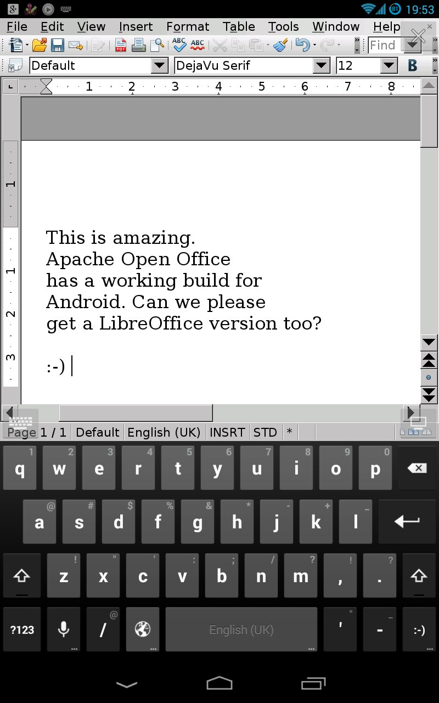

It doesn't work very well with the swipe keyboard mode, but this is amazing.

I'd prefer a Libre Office one, but for now... Finally some [decent ODF support for Android from Apache OpenOffice](https://play.google.com/store/apps/details?id=com.andropenoffice)!

**Update 2014/01/01**: it seems, [according to this comment](http://blog.documentfoundation.org/2013/12/30/libreoffice-is-available-on-the-ipad-and-chromebooks-thanks-to-rollapp/#comment-313988), that this is a proprietary :( compilation running with embedded X or something similar, and that a real native LibreOffice is coming! :)
