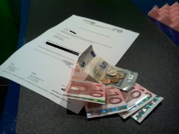
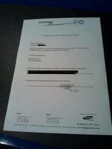
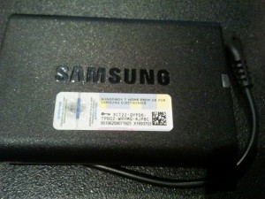
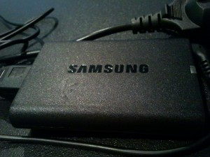

If you've been following me on this blog or other social networks you know I bought a Samsung NP900X3C. It's a very nice laptop but I'm forced for some obscure _cof OEM cof_ reason to buy a Microsoft WIndows 7 Home Premium OEM license.

When I bought it at Media Markt I immediately mentioned I wanted to get a refund on the Windows that was installed. **Media Markt** said I'd have to go to Samsung or Microsoft, that they wouldn't do that. Please remember this part...

Since It was the exhibition model they had there, I had no chance to explicitly reject the Windows license, so I went ahead and installed my favorite GNU/Linux distribution for personal use, Fedora, at release 20.

While it installed, [I opened a case with Samsung by "email"](https://contactus.samsung.com/customer/contactus/formmail/mail/MailQuestionGeneral.jsp?SITE_ID=64) and they replied to me soon enough by real email.

Samsung said that

1. I wasn't to turn the laptop on or accept the license \[_check, Media Markt did, I didn't_\]
2. that I should take it to the store \[_Media Markt,_ _which had preemptively rejected any process_\]
3. the store would use the official Samsung Service Center \[_which in Lisboa is just a few doors up in my street_\] to erase the disk and then
4. return it to the store in order to fulfill the refund

Well, if steps one and two were broken already and since the store is a few doors upwards, why not just go there directly?

That's what I did, but I was left hanging without any further details for up to three weeks and I was getting very pissed off. At least give me a piece of paper saying you won't do it, damn it! :)

So I went there today and said I wasn't going to leave the store without one of three things:

1. my satisfaction, aka, the Windows Refund, or...
2. a note explaining why they can't do it yet, or...
3. a note explaining why they won't do it.

Boy, where the poor nice guys at the service center pissed, _so there's this crazy guy trying to get money back from a Windows refund, what a nutty guy, never heard of that before and now I'm stuck here well past closing ours_, right? :)

Well, after a short talk on the phone with the owner, who was a bit defensive then, and waiting a bit more, I had a second talk with him and he was much, much friendlier now and willing to capture my satisfaction. **Nice!** I don't know exactly what happened, but they decided to fast forward the process.

Apparently, Samsung Portugal sent the request to Samsung Korea and never had any reply, so they were going to refund my 46.03 € in advance.

**Yes!**

I still had to explain the guys they had to take out the license from the charger because Samsung would need it to pay them back the money, but finally I could **officially** get rid of Windows and get back what I had paid for it.

