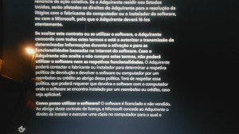

Remember when I though it was fishy that I should start the computer in order to get my wife's laptop reimbursed on the Windows we unwillingly were forced to pay?

So ASUS insists on this unbelievable process of activating the Windows license, and when I ask for a policy document or confirmation you know what happened? The same guy confirmed his own words to me... feels like a _trust me_ on a movie, and we always know where those famous last words lead, ie, the other party being sorry they gave trust.

Since I'm not willing to go around in a back and forth for much longer, I just demanded proof of the policy, pulling a screen shot from the Windows license where it's explicitly said that if I don't agree I can't use the computer, it's in Portuguese in the screen shot below, but it roughly translates to...

_If The Customer doesn't accept and doesn't fulfill these terms, he won't be able to use the software nor it's features_

I gave them until July 15th at 00:00 to comply, under penalty of, for all due effects, ASUS agreeing that I don't use nor plan to use Microsoft Windows and that it will process my due reimbursement.
