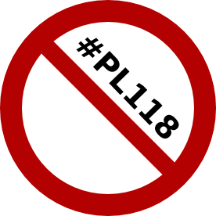

Este é o famoso [#pl118](https://plus.google.com/s/%23pl118), ou melhor a sua primeira encarnação.

[https://blog.1407.org/2011/05/03/proposta-do-ps-de-lei-da-copia-privada/](https://blog.1407.org/2011/05/03/proposta-do-ps-de-lei-da-copia-privada/)

A contestação na sessão de apresentação na SPA levada a cabo por um pequeno grupo de pessoas que representavam alguns grupos da sociedade civil assustou o PS (apesar de [não ter sido o Grupo Parlamentar do PS a escrever o texto](https://blog.1407.org/2012/01/06/quem-fez-o-pl118-nao-foi-o-ps/ "Quem fez o #PL118 ? Não foi o PS…")). Apesar de considerar a sua (eventual) proposta-lei **perfeita** e **ponderada**, sobretudo no que diz respeito às taxas a aplicar, não arriscou propor uma lei.

Como o PS perdeu as eleições, acabou por trazê-lo de volta da cova desta vez como o infame projeto-lei 118, na oposição, em 2012 com apenas umas vírgulas de diferença, e foi fortemente derrotado na praça pública, incluindo uma [petição que atingiu vários milhares de pessoas em poucos dias](http://www.peticaopublica.com/pview.aspx?pi=pl118nao "Petição Impedir a Taxação da Sociedade da Informação"), totalizando mais de 8 mil subscritores até o PS ter retirado a proposta e enterrar o projeto.

Em 2013, tendo empregado uma das pessoas que escreveu o documento original, o Governo (PSD+CDS) trá-lo de volta da cova e "apresenta" às escondidas a seu "nova" (eventual) proposta-lei a selectos privados, alguns jornalistas e os rendeiros do costume. Os primeiros reportaram ser aproximadamente o mesmo texto com pequenas diferenças, em geral as mesmas taxas. A contestação levanta-se e ao mesmo tempo surgiam novidades da Comissão Europeia que colocavam em causa o próprio conceito da taxa da cópia privada. Novamente enterrado numa gaveta.

Agora foi retirado novamente da cova. Pelo [artigo da Exame Informática](http://exameinformatica.sapo.pt/noticias/mercados/2014-07-31-Copia-Privada-veja-aqui-todas-as-taxas-propostas-pelo-governo "Cópia Privada: veja aqui todas as taxas propostas pelo governo")... Deve ser novamente o texto acima com algumas diferenças., a principal diferença parece considerarem um teto de 25€ uma grande generosidade.

**20€ representa cerca de 30% de aumento de custo em cima de um disco rígido de 1 TB** (preços atuais na Worten) onde guardo as fotos da família, e que volta e meia compro novo onde copio os dados dos antigos.

Pelos vistos as minhas fotos e vídeos devem alimentar [rendeiros que chantageiam o Estado](http://exameinformatica.sapo.pt/noticias/mercados/2014-07-30-Estado-pode-ser-processado-devido-a-prejuizos-da-Copia-Privada "AGECOP ameça processar Estado devido a alegados "prejuízos" da Cópia Privada") enquanto não desaparecem de vez, de tão obsoletos.

A contestação já sobe nas redes sociais e [o Governo já enterrou novamente a sua (eventual) proposta-lei](http://exameinformatica.sapo.pt/noticias/mercados/2014-07-31-Copia-Privada-governo-adia-decisao- "Cópia Privada: governo adia decisão"), mas tudo leva a crer que deverá ser retirado da cova novamente.

Haverá alguém que lhe dê com uma machete na cabeça de vez? É mau argumento de filme de zombie quando consecutivamente falham os golpes na cabeça e de sequela em sequela o zombie volta...

Entretanto a DECO parece ter acordado para o tema, depois de ter feito parte da escrita da primeira versão (para efeitos oficiais embora me tenha constado que só estiveram numa reunião), está agora (e ainda bem) francamente contra a (eventual) proposta-lei e publicou no seu site o artigo [Cópia privada: projeto de lei confunde direito com pirataria](http://www.deco.proteste.pt/tecnologia/telemoveis/noticia/copia-privada-projeto-de-lei-confunde-direito-com-pirataria "Cópia privada: projeto de lei confunde direito com pirataria")
