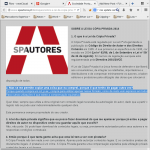
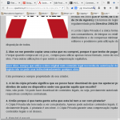
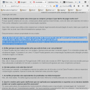
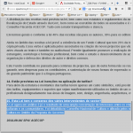

A Sociedade Portuguesa de Autores está, claro, de acordo com uma proposta de lei que pretende assegurar-lhe **indevidos** milhões de Euros roubados à vasta maioria dos cidadãos sob a espécie de um assalto legalmente autorizado quando compramos armazenamento digital para as nossas fotografias e filmes de férias, os nossos dados pessoais, os nossos trabalhos digitais (quase todos eles nos tornam, a nós próprios, automaticamente autores).

Está tão de acordo com o roubo através de uma taxa sobre a cópia privada que até faz uma [FAQ que não tem qualquer credibilidade](http://www.spautores.pt/destaques/sobre-a-lei-da-copia-privada-2014).

Exemplo 1, no ponto 2:

> 2\. Mas se me permite copiar uma coisa que eu comprei, porque é que tenho de pagar outra vez? Porque quando compra um cd, p.ex., compra para utilizar apenas nesse formato, como de resto vem expresso em todos eles. Para outras utilizações é que existe a compensação equitativa.
> 
> (...)

Todos os CDs dizem que só podem ser utilizados nesse formato?

A sério?

Não haverá um CD qualquer que não tenha isso, qual aldeia irredutível?

Vou investigar na minha coleção com mais de 300 CDs... pego em 3 aleatoriamente e... nenhum tem nada disso (aliás seria ilegal se o proibissem)... afinal será que a aldeia irredutível não poderá ser antes esta entidade obsoleta que só sobrevive se obter mama renda extorquida aos cidadãos?

Exemplo 2, ainda no ponto 2:

> 2\. Mas se me permite copiar uma coisa que eu comprei, porque é que tenho de pagar outra vez?
> 
> (...)
> 
> Quer dizer, sempre que utiliza a obra original num conteúdo legal necessita da autorização do autor, dado que a partir de um registo não se pode usar indiscriminadamente qualquer obra.

Huh? O que é que a Cópia Privada tem a ver com publicação de obras derivadas? **NADA**, a única motivação deste parágrafo é fazer as pessoas pensarem que fazem algo **indevido** ao passar para MP3 o CD que se comprou para ter várias músicas a tocar enquanto faz exercício ou para não desgastar o media original quando guarda CDs ao calor do carro.

Não fazem nada indevido, fazem algo **autorizado pela lei**, porque não faz qualquer sentido obrigar as pessoas a pagarem N vezes pela utilização **privada** daquilo que compraram legitimamente.

Exemplo 3:

> 3\. A lei da cópia privada significa que eu posso fazer download do que me apetecer porque já estou a pagar direitos de autor no dispositivo onde vou guardar aquilo que escolhi? Não, não pode. Só pode fazer download de conteúdos legais, ou seja, previamente autorizados pelos seus autores e nas respectivas condições contratuais.

O **Ministério Público** português considerou em 2012 [que é lícito descarregar cópias de filmes e música em redes de Partilha de Ficheiros (P2P) em Portugal](http://exameinformatica.sapo.pt/noticias/mercados/2012-09-26-ministerio-publico-diz-que-e-legal-copiar-musicas-e-filmes-na-net).

Adicionalmente, o ponto 4 poderia ser resumido à seguinte resposta: **porque os proponentes de se taxar pela cópia privada estão sempre a juntar os dois temas na praça pública**, alegando que nada têm a ver um com o outro mas estão **sempre** a puxar pela brasa. Isto causa uma associação mental na maioria das pessoas dos dois temas. O resultado é a confusão frequente.

Exemplo 4, no fim:

> 15\. Esta Lei tem o consenso dos vários intervenientes do sector?
> 
> A Lei agora em análise é já o resultado de uma ampla concertação \[dos beneficiados financeiramente pelas taxas\] de interesses entre os criadores e produtores de bens culturais e os consumidores \[apenas os associados da DECO, mas mesmo esta já se pronunciou **contra** a proposta de lei, por isso não a apoia nem pawrticipa no consenso\]. Foi debatida no Conselho Nacional de Cultura e afinada pelos sectores da Economia e da Cultura no âmbito da Proposta do Governo.

Ampla concertação _indeed_... gostava de saber sobre a concertação daqueles que vão ser chulados.

Acho que não preciso sequer olhar mais a fundo para esta FAQ mal intencionada.

Se a SPA precisa **mentir** e **confundir** para defender a **taxa** da cópia privada, que credibilidade tem esta taxa?
