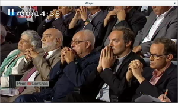
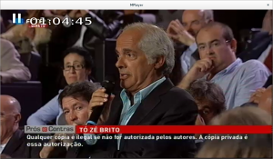
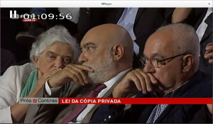
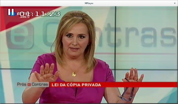
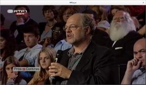
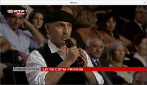
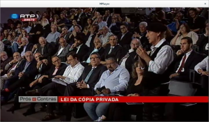

Ontem participei no Prós e Contras que se focou na polémica proposta de lei 246/XII do Governo, que pretende extender as taxas da cópia privada ao armazenamento digital, maioritariamente utilizado para outros fins.

Como seria de prever, a SPA levou os seus órgãos sociais quase por inteiro para assegurar mais tempo de antena (missão cumprida, _\*suspiro\*_), a organização do evento deveria ter tido mais cuidado... a posição da SPA já estava representada **na mesa** onde também deveríamos ter estado a Jonas e eu, mas algo se passou que isso foi cancelado, e duvido que fosse por falta de partes defensoras da infame proposta.

Sigam uns momentos de humor e não te esqueças de [subscrever a petição contra esta infame taxa](http://bit.do/pl246) ([http://bit.do/pl246](http://bit.do/pl246)), apesar de entregue parcialmente no dia 17 de Setembro não fechou e precisa muito da tua assinatura, dos teus amigos e familiares! :)

\[caption id="attachment\_2394" align="aligncenter" width="300"\] «Santo Secretário de Estado da Cultura, venha a nós a vossa taxa, e ámen!»\[/caption\]

\[caption id="attachment\_2400" align="aligncenter" width="300"\] Tó Zé, a cópia privada não é autorizada pelos autores, é compulsiva por definição na lei porque a alternativa era invasão de privacidade para controlar que não era feita...\[/caption\]

\[caption id="attachment\_2399" align="aligncenter" width="300"\] «Quem é ele? Quem representa? Não percebo nada, dê erre eme? Quéééé?»\[/caption\]

\[caption id="attachment\_2398" align="aligncenter" width="300"\] «Eu tenho a plateia inteira a pedir para falar», perdão, os órgãos sociais da #SPA ;)\[/caption\]

\[caption id="attachment\_2397" align="aligncenter" width="300"\] «Mais um que já não passo na casa dele quando vestir o fato vermelho...»\[/caption\]

\[caption id="attachment\_2396" align="aligncenter" width="300"\] O único que esteve em grande, pela canção colocada no domínio público em direto. Grande Vitorino Salomé!\[/caption\]

\[caption id="attachment\_2395" align="aligncenter" width="300"\] Vitorino, cuidado! O teu concorrente mais jovem não te vai pagar taxa pela tua prestação!\[/caption\]
